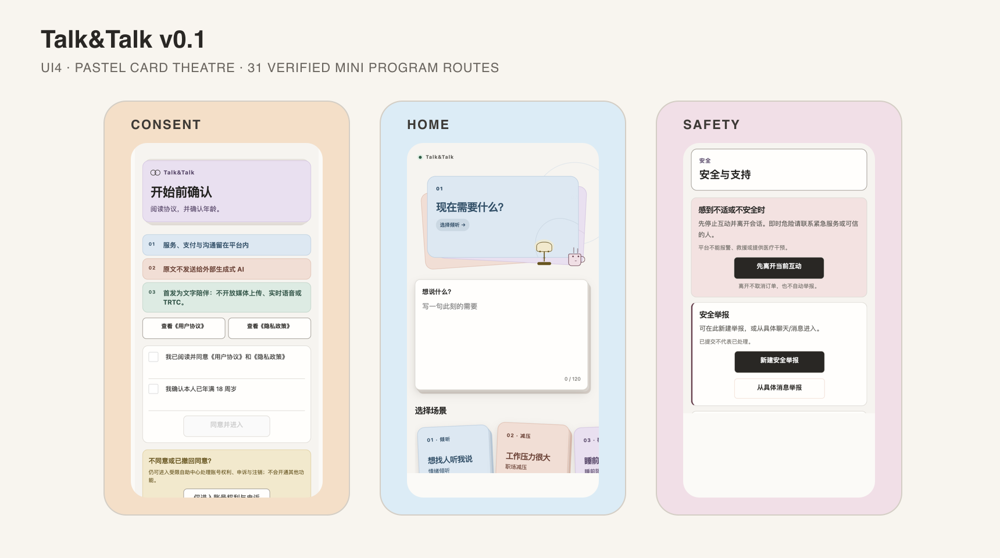
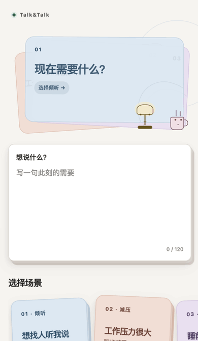

# Talk&Talk v0.1 · 浅彩卡牌剧场

微信小程序优先的女性友好线上陪伴产品。v0.1 以低饱和多彩卡片、正向叠层、有限动效和少文字界面，连接发现、预约、订单、沟通与支持。

`Mini Program first` · `UI4` · `本地验证完成` · `尚未发布`



[v0.1 更新说明](./docs/releases/v0.1.md) · [最终本地验收](./docs/2026-09-01-ui4-final-validation.md) · [UI4 设计系统](./frontend/miniprogram/UI4_DESIGN_SYSTEM.md)

> 当前结论：UI4 本地目标通过；外部发布仍为 **No-Go**。工作树尚未形成干净候选，也未提交、推送、上传或部署。

## v0.1 有什么不同

| 方向 | 表现 |
| --- | --- |
| 浅彩卡牌 | 蓝、杏、薄荷、薰衣草、奶油黄与玫瑰低饱和组合 |
| 立体层次 | 卡牌正向叠放，后层仍可命中；不使用负层级制造假深度 |
| 流畅动效 | 有限入场与交互反馈，稳定后停止；支持关闭动效 |
| 克制卡通 | 台灯、杯子、信封、文件夹等安静小物只出现在低风险场景 |
| 少文字 | 主界面只保留当前事实、下一步和关键边界；完整规则回到协议页 |
| 安全优先 | 支付、退款、身份、危机、证据与审核保持稳定 M0/M1 表达 |



[播放 MP4](./artifacts/v0.1/talktalk-v0.1-motion-demo.mp4) · [查看 31 页截图](./artifacts/v0.1/screens/README.md) · [媒体清单](./artifacts/v0.1/manifest.json)

GIF 和 MP4 均由真实微信开发者工具的确定性采样帧组成，只展示有限入场过渡；它们不是连续录屏，也不证明 FPS、真机性能或业务成功。

v0.1 媒体包已生成；来源、尺寸、SHA-256 与证据边界见[媒体清单](./artifacts/v0.1/manifest.json)，完整本地验收见[证据汇总](./artifacts/ui4-visual-evidence/evidence-summary.json)。

## 产品表面

| 表面 | v0.1 范围 |
| --- | --- |
| 微信小程序 | 首发产品面；普通用户与陪伴者的 31 个页面、18 个共享组件 |
| 公开 Web | `/`、`/how-it-works`、`/safety`、`/about`、`/partners` |
| API | NestJS + PostgreSQL + Redis，冻结 `/api/v1` 契约 |
| Admin / Review | 分离身份域的商业运营台与独立审核台 |
| iOS | 历史/后续工程，不在 v0.1 发行范围 |

```text
frontend/miniprogram/  微信小程序
frontend/web/          五个公开 Web 路由
backend/api/           API、Admin、Review、法律页
shared/contracts/      OpenAPI v1
infra/                 本地与部署参考
docs/                  设计、验收与运行手册
```

## 本地证据

- 小程序：31 页 × 3 宽度 × 2 主题，共 186/186 张微信开发者工具截图。
- 动效：首页 5 个不同入场帧、发现页 3 个不同过渡帧；稳定帧一致，无无限动画。
- 交互：后层卡命中、发现筛选、`motionOff=true` 终态已本地验证。
- 修复后 DevTools：最终隔离副本的组件 WXSS 源选择器警告为 0；`motionOff` 已重跑。
- 运行门：TypeScript、31 页结构、18 组件 UI4 审计与 894 次 API smoke 通过。
- 文案减法：小程序可见文字 -48.7%；五个公开 Web 路由 -64.1%。
- Web：完整 `npm run check` 通过；五路由 390/1280 本地浏览器无横向溢出。
- Admin / Review：静态预检 95/95；390/1280 登录页与身份域分离通过。

证据入口：

- [最终验收结论](./docs/2026-09-01-ui4-final-validation.md)
- [证据汇总 JSON](./artifacts/ui4-visual-evidence/evidence-summary.json)
- [186 张截图矩阵](./artifacts/ui4-visual-evidence/matrix/)
- [有限动效序列](./artifacts/ui4-visual-evidence/dynamic/)
- [交互与 motion-off](./artifacts/ui4-visual-evidence/interaction/)
- [截图后修复记录](./artifacts/ui4-visual-evidence/post-capture-remediation.json)

## 快速开始

需要 Node.js 22+、PostgreSQL、Redis，以及微信开发者工具。

### 1. 启动 API

```bash
cd backend/api
npm install
cp .env.example .env
npm run prisma:migrate
npm run start:dev
```

### 2. 打开小程序本地副本

```bash
npm --prefix frontend/miniprogram install
node frontend/miniprogram/scripts/create-local-copy.mjs \
  --api-base-url http://127.0.0.1:3000/api/v1
```

在微信开发者工具中导入 `frontend/miniprogram-local`。它是无 AppID、不可上传的本地副本；正式源仍是 `frontend/miniprogram`。

### 3. 可选：运行公开 Web

```bash
cd frontend/web
npm install
npm run dev
```

## 验证

```bash
# Mini Program
backend/api/node_modules/.bin/tsc -p frontend/miniprogram/tsconfig.json --noEmit
node frontend/miniprogram/scripts/validate.mjs
node frontend/miniprogram/scripts/smoke.mjs
node frontend/miniprogram/scripts/ui2-audit.mjs
node frontend/miniprogram/scripts/ui3-contrast-audit.mjs
node frontend/miniprogram/scripts/ui4-copy-audit.mjs

# Public Web
npm --prefix frontend/web run check

# API / Admin / Review static gate
npm --prefix backend/api run build
npm --prefix backend/api run test:preflight:static
npm --prefix backend/api run verify:prod-artifacts
```

PostgreSQL preflight、E2E、真实微信与生产操作需要获授权的隔离环境；不要把本地 smoke 当作商用验收。

## 发布边界

本仓库当前只能准确声称“v0.1 UI4 已实现并完成本地验证”。尚未完成：

- 干净候选 SHA、提交、推送、Git tag 或 GitHub Release；
- 微信 Preview、体验版 Upload、审核或生产部署；
- 真实客户/陪伴者/Admin/Review 全角色流程；
- 真实微信登录、身份授权、小额支付、服务端回调与退款；
- 微信真机性能、系统字体、长列表与触控验收；
- staging/生产域名、CDN、监控及外部合规/独立审核。

更多入口：[项目指南](./docs/GUIDE.md) · [小程序开发](./frontend/miniprogram/README.md) · [部署与回滚](./docs/deploy-rollback.md) · [后续范围](./NEXT_PHASE.md)
