# Talk&Talk v0.1 · 小程序 31 页

真实微信开发者工具 390 / light 截图。01 为匿名同意页，02–31 为 legal-only 失败关闭夹具；不是业务成功态。

| 01 | 02 | 03 | 04 |
| :--: | :--: | :--: | :--: |
| 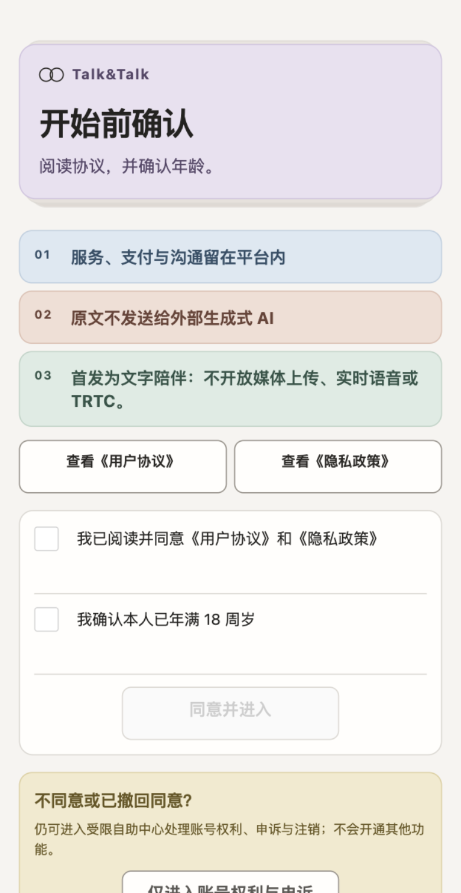 consent | 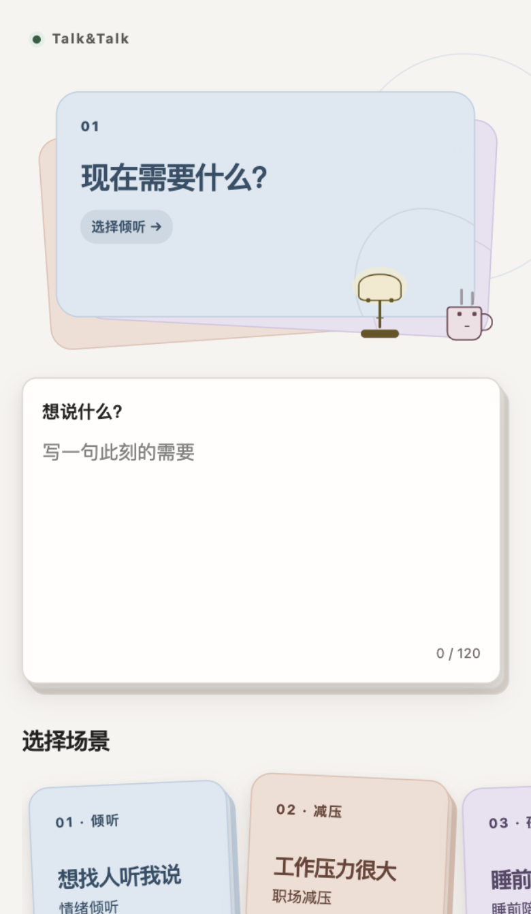 home | 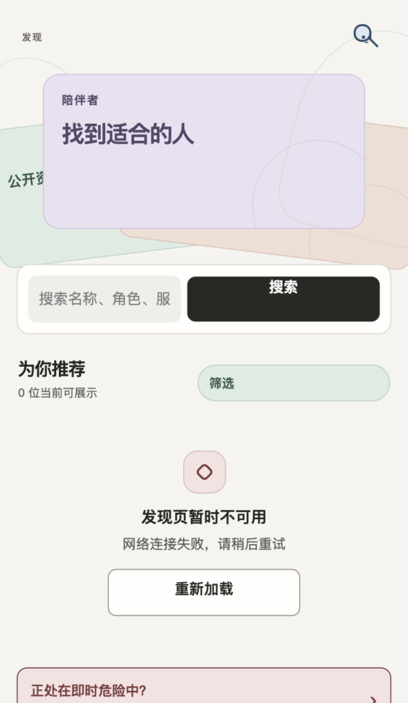 discover | 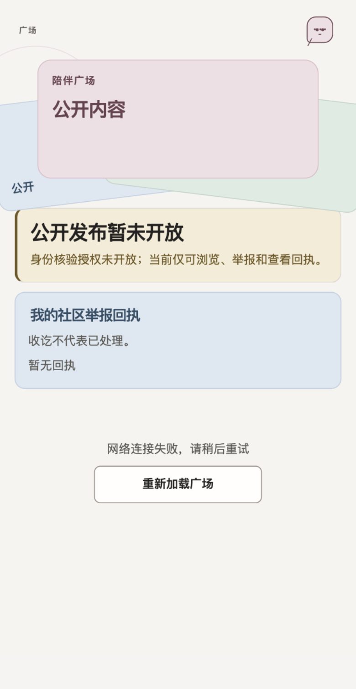 community |

| 05 | 06 | 07 | 08 |
| :--: | :--: | :--: | :--: |
|  orders |  order-detail |  order-payment |  order-aftercare |

| 09 | 10 | 11 | 12 |
| :--: | :--: | :--: | :--: |
|  order-dispute | 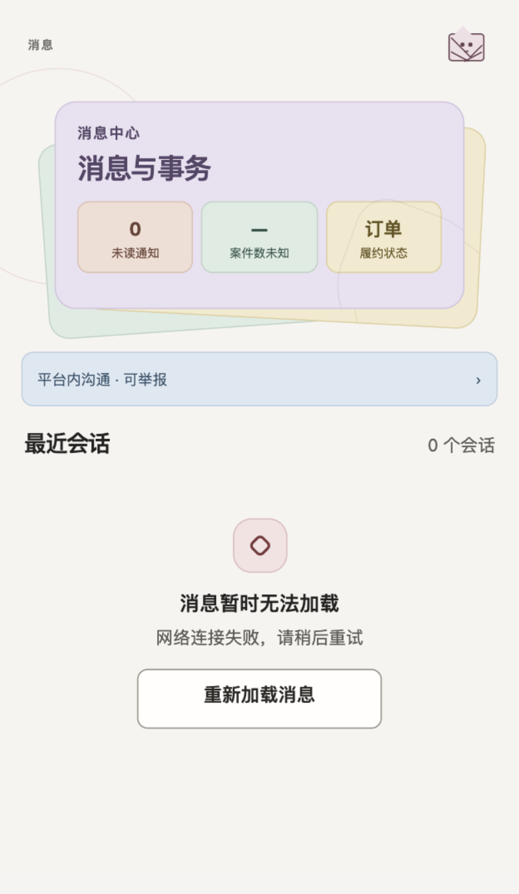 messages | 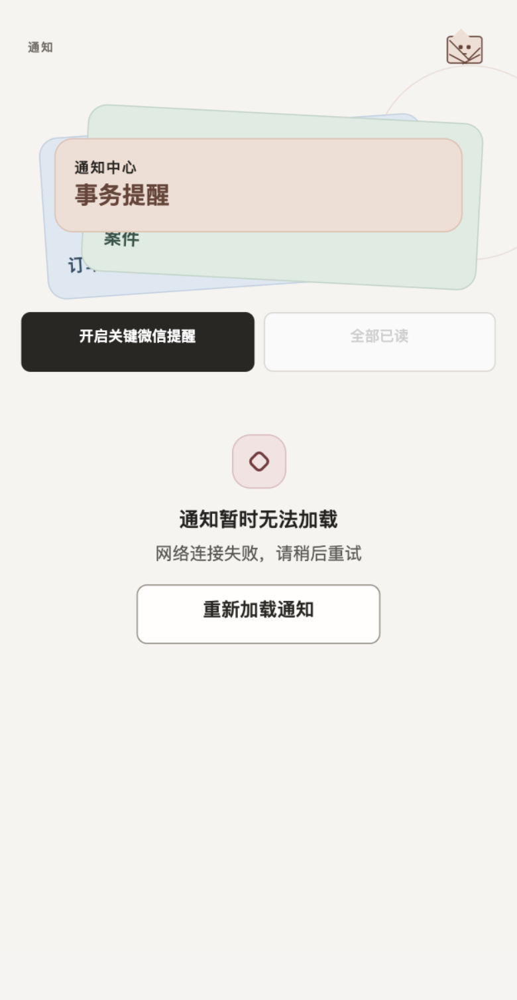 notifications |  profile |

| 13 | 14 | 15 | 16 |
| :--: | :--: | :--: | :--: |
|  account |  adult-eligibility | 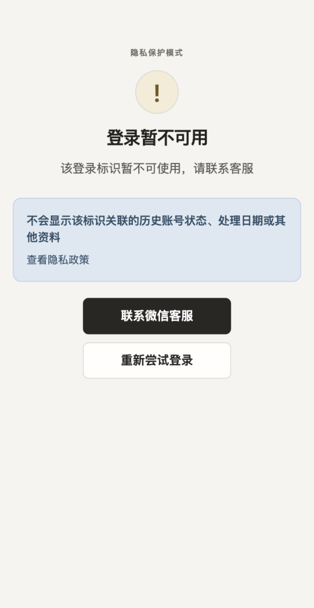 deletion-status | 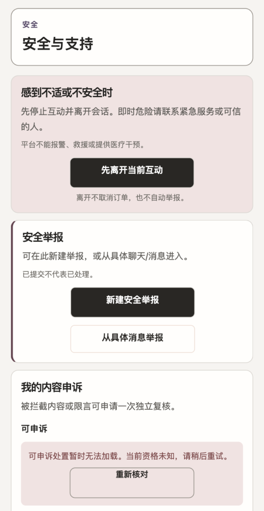 safety |

| 17 | 18 | 19 | 20 |
| :--: | :--: | :--: | :--: |
| 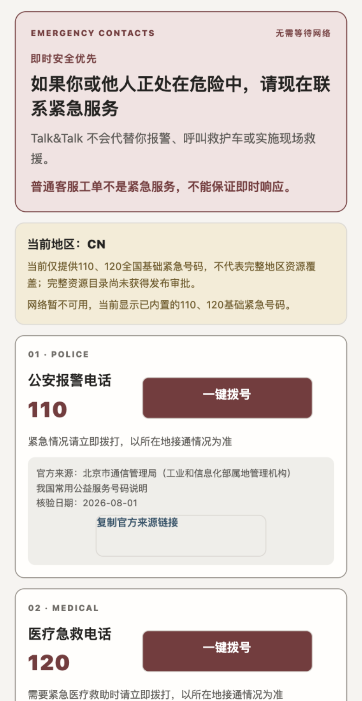 crisis | 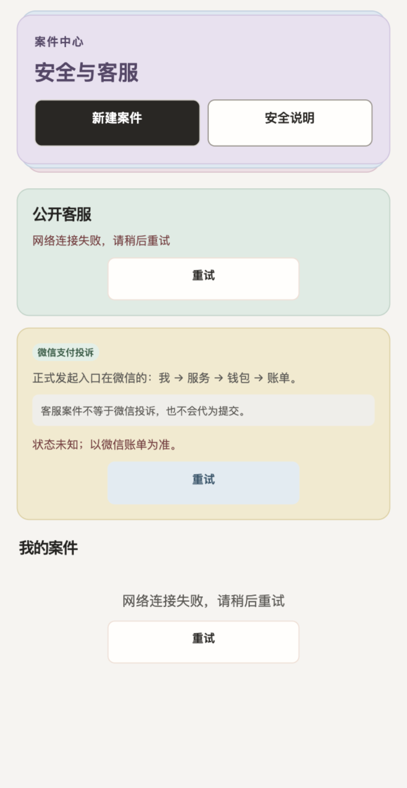 support |  support-detail |  companion-detail |

| 21 | 22 | 23 | 24 |
| :--: | :--: | :--: | :--: |
|  companion-workbench |  companion-onboarding |  companion-schedule |  companion-development |

| 25 | 26 | 27 | 28 |
| :--: | :--: | :--: | :--: |
|  companion-earnings |  companion-safety |  companion-services |  companion-availability |

| 29 | 30 | 31 |  |
| :--: | :--: | :--: | :--: |
| 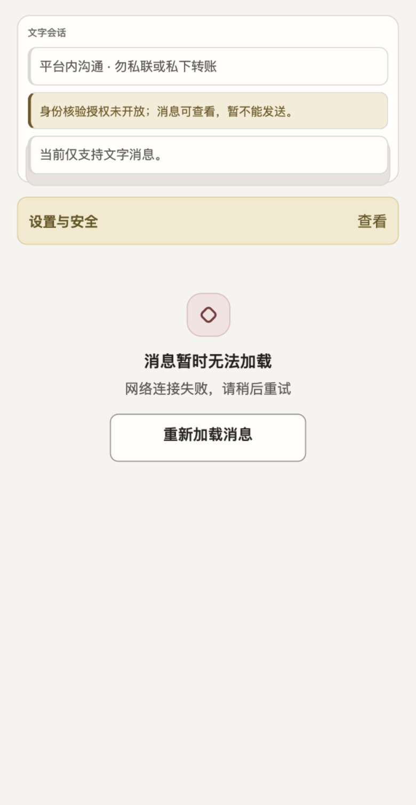 chat | 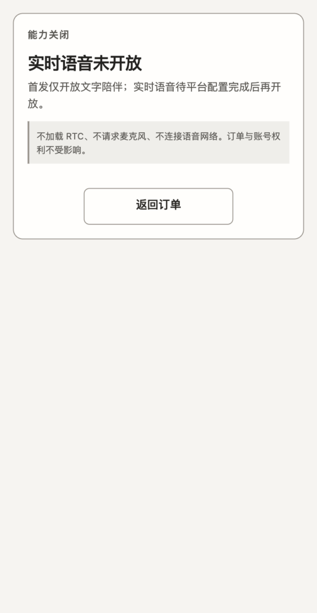 voice |  legal |  |

[返回 v0.1 媒体清单](../manifest.json)
