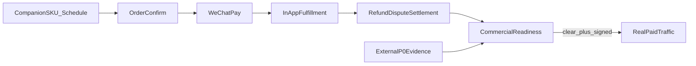

# Talk&Talk 后端商业化差距审查（CTO 视角）

审查日期：2026-08-04  
审查对象：NestJS `/api/v1`、Prisma 数据面、商用 readiness、运营/审核后台依赖的后端能力  
方法：仓库能力盘点 + 同类产品公开能力反向对照  
相关文档：[COMMERCIAL_RELEASE.md](./COMMERCIAL_RELEASE.md)、[commercial-market-cross-audit-2026-08-02.md](./commercial-market-cross-audit-2026-08-02.md)、[NEXT_PHASE.md](../NEXT_PHASE.md)、[production-checklist.md](./production-checklist.md)

> 本文是**后端商业化差距地图**，不是功能已经交付的声明。状态只用：`仓库已有` / `上线门禁` / `规模化缺口` / `增长后置` / `刻意不复制`。

## 1. 结论

**仓库侧双边交易、资金控制、审核与治理已经偏“可商用”**；**真正不能开放真实付费流量的主因是外部资质与联调证据，不是缺一套下单 API**。

对照松果倾诉、壹心理倾诉、简单心理、比心/陪聊类公开能力，以及 BetterHelp / Talkspace / 7 Cups 类远程双边服务后，下一阶段后端短板集中在：

1. **规模化自动结算**（受监管付款，替代人工带外转账）
2. **真实 KYC / 合同 / 税务适配器**（库内目前只有引用边界）
3. **语音/媒体完整表面**（`COMMERCIAL_SURFACE=full` 真机门禁）
4. **可证明增长与供给效率的业务数据面**（经营看板，而非仅 Prometheus）

2026-08-02 市场交叉审查结论维持：**仓库闭环 Go（自动化） / 生产放行 No-Go（外部门禁）**。

## 2. 已具备、不应再当缺口的底座

| 域 | 仓库现状 | 状态 |
|---|---|---|
| 交易闭环 | 预约确认 → 预下单/支付 → 履约窗口 → 完成/自动验收 → 退款快照 → 结算冻结 | 仓库已有 |
| 资金控制 | 微信 JSAPI、退款恢复、投诉 2.0、T+1 四类日账单、现金台账双人分类、追偿 | 仓库已有 |
| 供给经营 | 服务 SKU、结构化时段、周期规则/黑名单、14 天草稿生成、收益与提现申请面 | 仓库已有 |
| 安全治理 | 站内会话、本地规则审核、独立 `/review/`、举报/申诉、危机资源、账号动作双人 | 仓库已有 |
| 商用门禁 | `/admin/commercial/readiness` 汇总对账/退款/投递/注销等硬 blocker | 仓库已有 |

CTO 判断：首发 **text-only** 的“能不能收钱、能不能追责、能不能对账”主链在代码层已闭环。

## 3. P0 — 不完成就不能严肃谈商业化上线

### 3.1 外部证据包（代码不能代替）

| 项 | 说明 | 状态 |
|---|---|---|
| 微信主体与商户联调 | AppID/商户号/APIv3、JSAPI、退款、投诉回调、事务模板真机 | 上线门禁 |
| 公网 TLS / ICP / 合法域名 | API 与业务域名进入微信白名单 | 上线门禁 |
| 法律主体、客服、协议签字 | 退款政策批准引用与运行时版本一致 | 上线门禁 |
| 员工双人开通与密钥托管 | 禁止默认 seed/mock 身份 | 上线门禁 |
| 注销留存法律批准与擦除演练 | 分阶段 worker 已有，缺法务批准与演练证据 | 上线门禁 |
| 陪伴者 KYC/合同/税务/收款 | 库内只存外部引用 + 双人复核 | 上线门禁 |
| 托管 HA DB/Redis、监控、备份恢复、容量压测 | 有 `/metrics` 样例，缺生产采集与值班闭环 | 上线门禁 |
| 官方小程序发行证据 | 真 AppID、关域名豁免、体验版回归与审核上传 | 上线门禁 |

权威清单见根 [NEXT_PHASE.md](../NEXT_PHASE.md) 与 [COMMERCIAL_RELEASE.md](./COMMERCIAL_RELEASE.md)。

### 3.2 人工结算容量必须变成硬门禁

当前结算路径：

`领取任务 → 按订单收款快照带外付款 → 录入流水/金额/收款对象/凭证 SHA-256 → 另一名管理员复核`

低容量双人值班可跑，**不可当作规模化资金架构**。在自动付款上线前，后端应将以下事实写入 readiness（设计约束，尚未全部代码化为本审查后的实现项）：

- 已批准的人工付款日/周容量上限
- 在途领取超时与未复核凭证积压
- 追偿/坏账超过 SLA 的开放项
- 未配置付款提供方时，明确标记为 `manual_payout_only` 容量模式

### 3.3 受监管付款适配（规模化 P0）

| 设计选择 | 说明 |
|---|---|
| 推荐路径 | 微信**商家转账**（佣金/报酬场景）或服务商**分账 / 平台收付通**；禁止自建余额资金池 |
| 接入边界 | 复用现有 `CompanionEarning` / `CompanionWithdrawalRequest` / payout claim-submit-verify 状态机；外部调用在短事务外，结果以渠道权威查询为准 |
| 必有状态 | `requested` → `providerAccepted` / `providerRejected` / `outcomeUnknown` → 双人复核或电子回单落库；不明状态禁止宣称成功、禁止静默重放 |
| 税务字段 | 付款性质（劳务报酬/经营所得等）版本化；回单摘要与订单结算快照可对账；证件/银行卡原文仍只在外部系统 |
| 切换条件 | 法务/财务批准提供方、场景资质、单笔/单日限额、失败 SOP；人工模式仅保留为事故降级 |

对照：松果等平台公开提供倾听者结算申请与打款周期；陪聊 SaaS 普遍接微信/支付宝提现。Talk&Talk 有申请与人工凭证闭环，**缺自动付款与回单回写**。

## 4. P1 — 上线后短期内应补，否则运营与供给撑不住

### 4.1 经营看板只读聚合 API

**状态：仓库已有（2026-08-04）** — `GET /admin/commercial/ops-metrics`。

Prometheus 与推荐曝光事件不等于业务经营驾驶舱。已落地只读聚合（不碰支付权威写路径）：

| 指标组 | 示例 |
|---|---|
| 供给漏斗 | 入驻→培训完成→上架→有可约容量→首次接单 |
| 履约 | 确认率、拒单率、响应超时 |
| 时段 | 放出容量、占用率、空闲 |
| 资金售后 | 退款率/原因桶、投诉 SLA 达标与逾期 |
| 复购 | 同陪伴者再次下单、书签转化 |
| 安全 | 审核积压、申诉逾期（无正文） |
| 可约提醒 | fanout/pipeline 摘要与终态待核 |

消费方：`/admin/` 概览经营看板；禁止把聊天正文、证件、openid 带入看板。

### 4.2 轻量服务质量分级与整改任务

**状态：仓库已有（2026-08-04）** — 质量案件/整改任务/逾期 worker/发布闸/readiness。

壹心理倾诉公开投诉规则含 A–E 分级、督导反思、实习期、隐藏主页等。Talk&Talk **不复制医疗伦理体系**，已落地可运营质量层：

| 能力 | 设计要点 |
|---|---|
| 质量案件 | 与资金退款、内容审核分域；可关联订单/会话证据引用 |
| 轻量等级 | `noIssue` / `needsRemediation` / `restrictIntake` / `delist` |
| 整改任务 | 到期未完成则自动限制上架 |
| 复用 | companion-lifecycle、账号动作、非自审复核 |

### 4.3 可约提醒与候补

**状态：仓库加固已完成；投递默认仍关（上线门禁）。**

- 可约提醒投递 runner 默认关闭；放量需模板审批 + staging 真链 + 聚合指标值班
- Admin 增长页强化终态待核与“投递默认关闭”提示
- **不做**候补队列（另立项）

### 4.4 `COMMERCIAL_SURFACE=full` 后端门禁清单

**状态：代码门禁 + `s3_compatible` 媒体适配器骨架已有；外部证据仍门禁。默认保持 `text_only`。**

在切离 `text_only` 前，后端与外部须同时满足：

| 门禁 | 要求 |
|---|---|
| 配置 | `COMMERCIAL_SURFACE=full` 且显式允许 `TRTC_ENABLED` / `MEDIA_FEATURE_ENABLED`；预检失败关闭 |
| TRTC | 控制台应用、CAM、房间回调密钥、进退房事件验签、两台真机弱网证据 |
| 出席争议 | 仅可信房间事件可裁决；客户端心跳不得单独结案 |
| 媒体存储 | `MEDIA_PROVIDER=s3_compatible` + COS/S3 凭证；reserve→upload→verify→delete |
| 内容审核 | 媒体审核适配器；用户原文仍禁止外发生成式 AI（除非新法务门禁） |
| 语音介绍 | 受控试听 URL 与密钥；未配置时介绍批准保持 No-Go |
| 订阅模板 | 语音相关事务模板齐全并真机验收 |
| 默认录音 | **禁止作为默认质检**（刻意不复制 Cambly 录课） |

详见 [realtime-voice-release-checklist.md](./realtime-voice-release-checklist.md) 与 [production-checklist.md](./production-checklist.md)。

## 5. P2 — 增长与体验增强（不阻塞首发收费）

| 项 | 说明 | 状态 |
|---|---|---|
| 套餐 / 次卡 | 需新定价模型、部分履约与退款规则 | 增长后置 |
| 排班草稿批量激活、缓冲规则、外部日历 | 草稿生成器已有，启用链路仍浅 | 增长后置 |
| 多支付渠道（支付宝等） | 首发微信 JSAPI 足够 | 增长后置 |
| 真实短信提供方 | 小程序微信登录可暂缓 | 增长后置 |
| 订阅制权益账本 | 未履约结转、退订、税务新规则 | 增长后置 |
| 可解释匹配问卷 | 场景意图 → 匹配；禁止诊疗/量表临床字段 | 增长后置 |
| 即时连线订单 | 壹心理式 7×24；需新状态机与在线心跳 | 增长后置（产品选择） |
| OpenAPI 装饰器化、小程序 CI 上传 | 工程效率，非收入 blocker | 增长后置 |

## 6. 刻意不复制（维持）

对照陪聊 SaaS / 泛社交常见能力后，**明确不做或长期后置**：

- 钱包预充值资金池（抬高二清与资金池风险；首发保持订单直付）
- 礼物币、财富榜、付费排名
- 上下级分销 / 返佣团队
- 盲盒 / 抢单刺激玩法
- 默认录音质检
- 医疗诊断、疗效承诺、AI 危机处置人
- 未成年人模式
- 拆用户端与陪伴者端两个安装包（非商用必需）
- 多租户白牌 SaaS（当前单运营商正确）

## 7. 竞品反向对照摘要

| 来源（公开资料） | 可迁移结论 | 对我们的含义 |
|---|---|---|
| 松果倾诉 | 预约、多模态、倾听者结算周期与抽成公示、禁止站外 | 结算自动化与供给规范是规模化关键；拆双 App 非必需 |
| 壹心理倾诉 | 即时倾诉、投诉分级、督导/整改、风险转介 | 要质量整改工单与危机转介运营，不复制临床体系 |
| 简单心理 | 预约申请、支付时限、咨询师确认、改约/退款帮助、多支付 | 预约后掌控感与售后分域已基本对齐；多支付后置 |
| 比心 / 陪聊源码系 | 目录、时段、评价、钱包、礼物、分销 | 目录与履约可学；虚拟币与分销不学 |
| 7 Cups / Supportiv | 非危机边界、训练同伴、站内沟通 | 仓库已有对应边界；地区 SOP 是门禁 |
| BetterHelp / Talkspace | 匹配、消息/音视频、合规、企业通道、营销分析 | 可学匹配可解释性与运营数据；不学诊疗与 HIPAA 产品层 |

## 8. 建议落地项目切分

P1 仓库项（经营指标、质量整改、提醒加固、full 代码门禁/媒体骨架）已于 2026-08-04 落地。后续独立项目：

1. **资金自动化**：付款提供方适配 + 提现状态机 + 回单/税务字段 + readiness
2. **完整表面外部证据**：TRTC/媒体真机与模板审批后，才可切 `COMMERCIAL_SURFACE=full`
3. **可约提醒受控放量**：模板审批 + staging 演练后才开 delivery runner

## 9. 最终判定

| 层 | 判定 |
|---|---|
| 首发 text-only 交易/风控代码 | **可支撑封闭收费试点**（仍须外部 P0 签字） |
| P1 经营看板 / 质量整改 / 提醒加固 / 媒体骨架 | **仓库已有** |
| 生产开放真实付费流量 | **No-Go**，直到第 3 节外部门禁齐套 |
| 规模化供给结算 | **No-Go**，直到受监管付款适配上线或人工容量硬门禁被批准并执行 |
| 增长型功能（套餐/分销/礼物/即时连线） | **后置或刻意不复制**，不计入首发缺口 |
