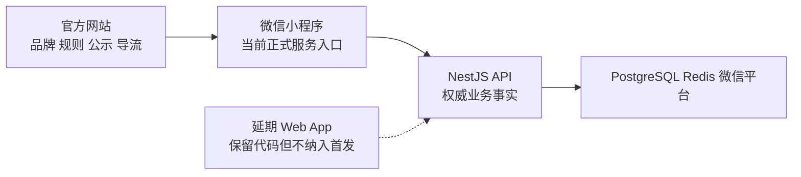

# 10｜官网 + 微信小程序长期任务执行指南

> 用途：在用户明确批准后，作为 Codex 长期目标任务的执行约束。  
> 当前状态：**只生成指南，不代表已经授权实施、部署或发布。**  
> 默认目标：完成官网与微信小程序实现、取得 G1 Go，并把 G2 所需材料准备到 ready；G2 实际验证和 G3 生产放行均须另行授权。

## 1. 推荐的产品边界

长期任务开始前先把 G0 固定为以下默认口径；若用户选择不同口径，必须先更新决策日志，再改代码。

| 产品面 | 当前责任 | 当前不承担 |
|---|---|---|
| 官方网站 `frontend/web` 公共页面 | 品牌、产品说明、服务边界、安全、公示、合作、SEO、微信小程序入口 | 不作为真实预约、支付、聊天和售后完成面的证据 |
| 微信小程序 `frontend/miniprogram` | 当前唯一正式消费者/陪伴者服务面：登录、发现、预约、支付、订单、消息、举报、售后、数据权利和工作台 | 首发不开放媒体、TRTC 语音、公开直播或站外交易 |
| NestJS `backend/api` | 身份、权限、价格、可售、订单、支付、审核、消息和财务的权威事实 | 不因客户端需要而复制第二套业务规则 |
| `shared/contracts/openapi/v1.yaml` | 官网未来交易路由、小程序和 API 的共享契约边界 | 不允许两个客户端用私有字段猜测服务端状态 |
| 网页会员/交易路由 | 现有代码保留、继续 `noindex`，并在生产候选中由路由开关、404/跳转或独立域名明确禁用，默认视为延期 Web App 能力 | 未经重新立项不得公开访问、进入官网主导航、SEO、当前验收或生产承诺 |

| 路由组 | 默认处置 |
|---|---|
| `/`、`/how-it-works`、`/safety`、`/about`、`/partners` | 官网优先交付 |
| `/business`、`/demo` | 逐条核验证据后由用户决定是否公开 |
| `/discover`、`/companions/*`、`/login`、`/community`、`/orders`、`/messages`、`/profile`、`/workbench` | 生产暂停，未来 Web App 单独立项 |
| `/api/session/*`、`/api/backend/*` | 只供隔离开发联调；官网生产候选默认禁用 |

推荐信息流：



G0 必须分别确认：

| Decision ID | 决策 | 推荐默认 |
|---|---|---|
| G0-D01 | 官网、小程序、延期 Web App 的产品责任 | 官网解释/导流，小程序完成服务，交易 Web 延期 |
| G0-D02 | 延期交易路由的生产禁用方式 | 明确 feature flag + 404/跳转；不得只用 `noindex` |
| G0-D03 | `/demo` 是否成为公开官网页面 | 默认私密，逐条核验证据后再公开 |
| G0-D04 | 是否继续维护 Web BFF/交易集成测试 | 默认仅隔离开发保留，不作为公共官网完成条件 |

四项未确认前只能调查和整理现有改动，不能做范围性删除、路由重写或大规模重构。

`robots` / `noindex` 只控制搜索引擎，不是访问控制，也不能证明交易 Web 已关闭。

### 当前起点（2026-08-04，启动时必须重验）

- `frontend/web` 已有一批未提交的官网品牌与内容改动，同时仍保留登录、发现、订单、消息、社区、资料、工作台和 BFF；不能在未建立 ownership map 前继续叠加修改。
- Web 当前只有本地 `npm run check`，没有独立 GitHub Actions 必需工作流；`globals.css` 和部分产品文件已成为并行修改热点。
- 小程序当前注册 31 个页面、5 个 Tab；结构、TypeScript、runtime smoke 与本地副本隔离可形成 E2 基线，但不证明体验版或真机。
- 小程序 `models.ts` / `api.ts` 与 Web types 主要为手工维护，并非完整 OpenAPI 生成物；共享 DTO 和错误码有漂移风险。
- 当前 API/CI、真实身份、安全评估、灾备和外部平台门禁仍按 [首轮缺口台账](./registers/current-assessment-2026-08-04.md) 处理。

## 2. 长期任务目标

先区分三个不能混用的完成层级：

| 层级 | 含义 | 是否需要外部写操作 |
|---|---|---|
| `Implementation complete / G1 Go` | 当前 SHA 的代码、契约、测试、构建和候选材料通过 | 否 |
| `G2-ready` | staging/体验版步骤、账号、测试数据、设备矩阵和证据计划已准备；G2 Gate 仍可为 `BLOCKED` | 不必；默认长期任务可在这里正常结束 |
| `G2-validated` | 经精确授权完成体验版、HTTPS staging、真实微信登录和双角色真机，取得 E3 | 是；逐项授权后才能执行 |

`G2-ready` 不是 G2 PASS，不能写成“已通过 staging”或“已完成真机验收”。

将当前工作树整理成一个可持续交付的官网 + 微信小程序候选，做到：

1. 官网对外表达真实、清楚、可访问，所有主 CTA 能可靠引导至已验证的微信小程序入口，或提供诚实的搜索/尚未开放 fallback；
2. 小程序的消费者主链和陪伴者履约链使用同一套服务端事实；
3. 公开发帖和即时通讯前的真实身份门禁在服务端生效；
4. 首发目标始终为 text-only，常规媒体和 TRTC 入口不可达；若存在受监管的 provider/后台售后媒体通道，必须先有独立产品/运营决策，将其明确为受控例外、端到端关闭或整面延期。未决时不得将候选称为全局 text-only 或给出 G1；
5. 官网、小程序、共享契约与必要后端改动在同一候选 SHA 下通过 G1；
6. 准备 HTTPS staging、真实微信体验版和双角色真机的 G2 执行包；取得额外授权后才继续到 G2-validated；
7. 生产资质、真钱、KYC、恢复和值班未齐时仍明确为 G3 No-Go。

### 默认完成定义：Implementation complete / G1 Go / G2-ready

默认长期任务只有同时满足以下条件才可标记“实现完成”：

- G0 口径已由用户确认，`frontend/web` 既有改动归属清楚；
- 官网和小程序没有相互冲突的价格、服务范围、安全、年龄和法律表述；
- 当前 SHA 的 Web、Mini Program、相关 API 构建/测试/契约门禁全绿；
- 需要数据库的测试在隔离 PostgreSQL/Redis 中执行，不以 skip 代替通过；
- 官网桌面/移动端自动与本地交互证据齐全；小程序体验版、真机所需账号/场景/预期/证据模板已经准备，未执行项保持 `BLOCKED`；
- 每一项残余 P0 都继续阻断对应 Gate；
- 交付了候选 manifest、验证台账、风险、回滚说明和下一步，而不是只交付代码。

只有在用户另行授权 Phase 7 外部动作并取得 HTTPS staging、体验版和双角色真机 E3 后，才可把 G2 标为 `PASS` / G2-validated。

“Sites 页面 200”“本地构建通过”“开发者工具能打开”均不能单独满足任何 Gate。

## 3. 明确排除

除非用户重新立项，本长期任务不做：

- iOS / App Store；
- TRTC、语音、媒体上传、录音、直播、群聊；
- 网页端正式收款、聊天或陪伴者交易工作台发布；
- 新会员、虚拟币、礼物、排行榜、订阅和自动续费；
- 生产数据库迁移、公开部署、真钱支付退款、微信后台提交；
- 与官网/小程序主链无关的大型架构重构；
- 为了测试变绿而放宽订单、身份、支付、审核或安全规则。

后端和基础设施只在官网/小程序的权威主链确有需要时进入范围，并必须记录 blast radius。

### 外部动作授权边界

以下动作即使技术上已准备好，也必须取得**针对本次动作、精确目标和有效期的单独授权**；“可以继续”“按计划做”或对其他环境的授权不能复用：

- 任意 git push/PR、private preview、staging 或 production 部署；
- DNS、TLS、CDN、数据库、Redis、对象存储等云资源创建或修改；
- GitHub、Sites、微信公众平台、微信支付等后台变量、密钥、合法域名和隐私接口配置；
- 小程序体验版上传、版本设置、提审和发布；
- 主体、账号、法律域名、备案、隐私清单和第三方处理者配置；
- 真实付款/退款、外部消息、真实用户数据写入和公开流量切换。

每次授权至少记录：动作、精确目标、范围、授权来源/Evidence ID、授权时间、失效时间、执行者、结果和执行后复核。授权目标或参数发生变化时必须重新授权。

## 4. 模型与智能体规则

| 角色 | 默认模型 | 责任 |
|---|---|---|
| 主负责人/技术总监 | `gpt-5.6-sol / ultra` | 目标、范围、计划、共享文件、整合和决策记录 |
| 官网规划/审查 | `gpt-5.6-sol / ultra` | 公共官网、SEO、无障碍、文案证据和导流验收 |
| 小程序规划/审查 | `gpt-5.6-sol / ultra` | 首次使用、交易、消息、工作台、真机和微信门禁 |
| 独立质量发布 | `gpt-5.6-sol / ultra` | 不参与实现结论，独立复核测试、证据、范围和放行 |
| 代码编写 | 用户指定 Luna Ultra（仅在环境存在可调用 model ID 时） | 在批准切片内编写代码，不自行扩大范围 |

如果 Luna Ultra 不可调用，不得静默冒充或替换；每次长期任务启动和恢复到首次编码前都要重新探测可调用能力，并把探测时间与结果写入 `state.md`。不可调用时应在写代码前报告，并由用户选择等待 Luna 或以 Evidence ID 明确批准指定模型作为降级编写模型。当前环境没有 Luna Ultra，因此本轮只产出指南。

`state.md` 必须按智能体、角色和 Slice ID 逐行记录 requested/actual model、reasoning、检查时间、Luna capability 和 fallback Evidence ID；角色表中的默认值不是实际运行证据。任一 planner/reviewer 未证明实际为 `gpt-5.6-sol / ultra`，或 writer 未证明 Luna/获批 fallback 时，其产出不得进入 `completed`。

并行上限：全局最多两个实现切片；主负责人之外最多三个临时智能体。官网与小程序可并行调查，或在已登记 file lease 且文件不重叠时并行修改。`backend/api`、`shared/contracts`、根级文档、CI 和跨端整合统称共享切片，只能由主负责人串行推进，且共享切片实施期间不得同时运行客户端实现切片。禁止两个智能体同时修改同一文件或同一生成物来源。

建议分波次：第一波为主负责人 + 官网 + 小程序 + 只读 QA；客户端需求冻结后，第二波再用后端支持者替换已完成的调查角色。共享/后端切片开始前，依赖它的客户端切片必须先进入 `awaiting_review` 或暂停，避免同时改契约两端。`frontend/web/app/globals.css`、`frontend/miniprogram/utils/api.ts`、订单列表/详情、smoke 和 OpenAPI 必须设置单一修改 owner。

## 5. 长期任务的续跑协议

用户明确说“按此指南进入目标模式”后，才创建长期目标。不得因为本指南存在就自动开始。

每个长期任务建立：

```text
docs/cto-self-audit/runs/<TASK-ID>/
├── state.md          # 唯一断点续跑状态
├── scope.md          # 基线、包含/排除面、dirty ownership
├── decisions.md      # 需要用户确认及已确认决策
├── change-map.md     # 切片、文件、契约和迁移影响
├── validation.md     # 命令、环境、结果、skip 与证据引用
└── handoff.md        # 当前结果、残余风险、下一动作
```

`state.md` 使用 [长期任务状态模板](./templates/long-running-task-state.md)。它必须在每个切片完成、任务中断、上下文压缩或用户改变要求前更新。

文件职责不能混用：

- `state.md` 是当前 Phase、Gate、切片状态和 `next_exact_action` 的唯一事实源；
- `validation.md` 是 append-only 证据日志，只追加命令/场景与结果，不维护“当前状态”；
- `handoff.md` 只在交接时由 `state.md` 生成快照，不作为第二份活动状态手工并行维护；
- `scope.md` 保存初始 dirty ownership 和基线 hash；`state.md` 保存当前 hash、divergence 与 file lease。

### 每轮恢复顺序

1. 读取目标状态和 `state.md`，确认上次停在哪里；
2. 读取 `git status --short`，并逐项比较 dirty ownership map 的 baseline/current hash，识别用户改动和本任务改动；
3. 检查当前 SHA、file lease、未完成验证和外部状态是否已经失效；
4. 只恢复 `next_exact_action` 指向的一个切片；
5. 若用户新指令改变范围，先更新决策与计划，不继续旧实现；
6. 切片结束后记录结果、验证、风险和下一精确动作。

每个产品面最多一个 `in_progress` 切片：官网一个、小程序一个；全局最多两个实现切片。涉及 `backend/api`、共享契约、CI、根文档或跨端整合时全局只能有一个共享切片，且客户端实现切片必须先进入 `awaiting_review`、`completed` 或暂停。所有并行切片必须有同一个集成负责人，不能留下无人整合的半成品。

任何文件进入修改前都要登记 file lease（path/glob、surface、owner、agent、baseline hash、取得时间）；review 结束或回滚后才能释放。出现未登记的新 diff、hash 与 ownership map 无法解释的变化、或 lease 重叠时立即停止写入并重新归属。

lease heartbeat 超时不代表可自动释放。集成负责人必须先核对 live agent 状态、对应 Slice ID、工作树 diff、baseline/current hash 和最后 checkpoint，再记录转移原因与 Evidence ID 后重新分配；无法核对时保持 `conflicted` 并停止相关文件写入。

### 状态不可混用

| 类型 | 值 | 用途 |
|---|---|---|
| 工作状态 | `pending / in_progress / awaiting_review / completed / blocked / cancelled` | 表示切片推进 |
| 审查状态 | `PASS / PARTIAL / FAIL / BLOCKED / STALE / UNKNOWN / N/A` | 表示控制项证据 |
| 对用户汇报 | `保留 / 调整 / 暂停 / 待验证 / 上线门禁` | 表示当前产品决策 |

只有独立 reviewer 能把切片从 `awaiting_review` 改为 `completed`；没有 Evidence ID 的切片不能完成。`blocked` 必须记录原因、解除条件和仍可继续的独立工作。

## 6. 单个切片标准

每个切片必须围绕一个可观察结果，例如“官网所有主 CTA 在配置缺失时仍有可用 fallback”或“小程序未实名用户发帖被服务端拒绝”，不能用“优化前端”作为切片。

范围预算：一个切片只允许一个可观察结果、一个主产品面，以及为该结果不可分割的契约/后端/测试支持。SAST、SBOM、历史依赖、CSS 拆分和其他总台账缺口默认进入 backlog；只有它们直接阻断当前候选（例如当前 high/critical 漏洞或必需 CI 红）时，才能形成独立批准切片，不能顺手扩成全仓治理。

切片记录至少包含：

- 用户结果与不做事项；
- 受影响页面、API、契约和数据；
- 预期文件范围及用户 dirty 文件重叠；
- 实现者、独立 reviewer；
- 验收命令、真实交互和失败负例；
- Evidence ID、状态和失效条件；
- 回滚方法和下一切片。

标准工作循环：`调查 → 小计划 → 实现 → 定向验证 → 独立复核 → 相关全量回归 → 更新状态`。

## 7. 执行阶段

### Phase 0｜G0 范围和基线

目标：避免长期任务建立在错误产品身份或被覆盖的用户改动上。

动作：

- 固定 commit、branch、工作树、Node/微信开发者工具版本；
- 将当前 `frontend/web` dirty 文件划分为用户资产、待审资产和本任务可改资产；
- 固定官网公共路由、延期 Web App 路由、小程序 31 页面和 text-only 开关；
- 只读提出 Web 交易路由的生产禁用候选方案与验证计划；`noindex` 不计作禁用，G0-D02 确认前不实施；
- 记录 Web README、路由与实际产品责任的冲突；G0 确认前只登记，不改产品文档；
- 未确认归属前不删除未引用组件/品牌资产；大体量 CSS 拆分必须作为独立切片，不与内容改版混做；
- 用户确认 G0-D01～G0-D04；确认前 Phase 0 只允许写本任务的 `runs/<TASK-ID>/` 状态与计划文件；
- 建立首次 `state.md`、scope、change map 和验证基线。

退出条件：G0 为 Go；范围仍冲突时保持 `暂停`，不进入编码。

### Phase 1｜共享产品事实与 P0 前置

目标：先解决两个客户端都会继承的错误，避免分别补丁。

动作：

- 建立官网、小程序、OpenAPI、后端 DTO 的 capability/field/error 矩阵；
- 明确价格、SKU、时长、可售、订单、支付、消息、审核和身份的权威来源；
- 补公开发帖与即时通讯真实身份服务端硬门及负例；
- 算法治理和适用性结论未闭环前关闭个性化推荐，保留不依赖个人特征的手动发现路径；
- 统一法律同意版本、年龄边界、安全/危机表述和 text-only 能力；
- 修复当前候选依赖审计、契约或 CI 阻断，不把历史绿灯作为结果。

退出条件：共享 P0 有自动测试；Web 与小程序不再用本地 fixture 或客户端字段覆盖服务端事实。

### Phase 2｜官方网站公共面

目标：形成真实、可信、能导向小程序的正式官网候选。

默认公共范围：`/`、`/how-it-works`、`/safety`、`/about`、`/partners`；`/business` 与 `/demo` 是否公开由用户逐条核验证据后单独决定。

动作：

- 统一定位、服务边界、18+、非医疗/非急救、平台内交易和 text-only 口径；
- 验证 Mini Program 深链、二维码、复制搜索三种入口及无配置 fallback；
- 对入口 URL 的协议和域名做 allowlist，拒绝任意协议、凭据、query/fragment 注入；
- 只展示已验证主体、联系、备案和合作信息，空值明确为待核验；
- 清理公共导航、canonical、OpenGraph、sitemap 和 robots；
- 更新 Web README 与路由说明，使其不再同时承诺“正式官网”和“当前完整交易客户端”；
- 明确 CSP、frame、referrer、permissions 等浏览器安全头及第三方资源边界；
- 保证延期交易路由不被 SEO、官网 CTA 或公开演示误认为正式服务；
- 证明生产候选直接访问延期交易路由时会按批准策略拒绝、404、跳转或进入独立未发布环境；
- 建立逐路由 disposition matrix，记录公开/条件公开/生产禁用策略及对应 Evidence ID；
- 在 320/390/768/1440px 证明无水平溢出，主任务、导航和 CTA 可完成，并保存同一 SHA 的截图 Evidence ID；
- 证明全流程键盘可达、焦点可见、200% 缩放可用、`prefers-reduced-motion` 生效，并记录失败负例；
- 使用记录了工具名与版本的检查证明 WCAG AA 对比度；建立改动前性能基线，候选不得回退，或必须有用户批准的明确预算与 Evidence ID；
- 私密预览可作为验收证据，公开发布仍需单独授权。

退出条件：`npm run check` 全绿；公共页面视觉/无障碍通过；延期交易路由不可作为生产服务访问；所有主 CTA 能到正确小程序入口或明确 fallback；没有未经核验的规模、资质或“App 即将到来”时间承诺。只有真实入口/二维码通过验收后才能写“立即进入”，否则保持微信搜索或尚未开放的诚实降级。

### Phase 3｜小程序消费者主链

目标：优先让真实用户安全完成一次 text-only 服务。

按顺序验收：

1. 首次协议与隐私 → 微信登录；
2. 成年/真实身份状态与恢复入口；
3. 首页/发现 → 陪伴者详情 → 结构化 SKU/可约；
4. 创建订单 → 陪伴者确认 → JSAPI 支付 → 服务端状态确认；
5. 订单内消息 → 拉黑/举报/危机入口；
6. 完成 → 评价 → 售后/退款/投诉；
7. 数据访问、更正、导出、注销状态。

要求：支付成功只认服务端回调；未知状态不显示成功；媒体/语音入口不可达；错误、空状态和弱网可恢复；未实名用户不得公开发帖或即时通讯。

实现退出条件：自动结构/类型/smoke 全绿，隔离后端 E2E 通过，体验版所需账号、场景、预期和证据模板已准备。只有 Phase 7 获授权后，才执行真机消费者主链并归档 E3 与失败负例。

### Phase 4｜小程序陪伴者履约链

目标：让已审核陪伴者在不越权、不绕 KYC 的条件下履约。

按顺序验收：

- 当前身份、复审和限制状态；
- 服务商品与真实可售时段；
- 待确认、今日任务、开始、完成、异常和改期；
- 订单内消息与安全事件；
- 收益事实、冻结、申诉和售后关联；
- 普通用户无法通过页面路径进入陪伴者能力。

实现退出条件：双角色权限与状态变更 E2E 通过，真机测试包已准备；任何上架/KYC/结算外部证据缺失继续失败关闭。只有 Phase 7 获授权后才执行双角色真机并形成 E3。

### Phase 5｜官网 × 小程序一致性

目标：两个面像同一个产品，同时各自只承担被批准的职责。

核对：

- 品牌名、定位、年龄、服务边界、危机和联系方式；
- 官网 CTA 与小程序名称、路径、二维码和真实可用状态；
- SKU、价格、时长、交付方式和可售均只在小程序/服务端显示权威结果；
- 法律版本、隐私入口、第三方处理者和更新时间；
- 官网不承诺小程序尚未具备的能力；小程序不出现首发排除能力；
- 只有用户单独批准启用 Analytics 后，才记录最少必要的官网导流和小程序漏斗；默认不新增跟踪。获批后仍不得采集聊天或身份原文，并要记录事件清单、法律依据、保留期和关闭方法。

退出条件：建立逐项 cross-surface matrix，所有差异有 owner、理由和测试。

### Phase 6｜质量、安全与 CI

目标：把“本机能用”变成可重复的 G1 候选。

- Web、Mini Program、必要 API 检查绑定同一 SHA；
- CI 配置包含 Web 正式检查，不再只检查 API/小程序；本地运行同构命令，远端 push/PR/托管 CI 仍按外部动作单独授权；
- 直接阻断当前候选的 high/critical 依赖、secret、SAST、SBOM 和制品来源问题形成独立切片；非直接阻断项进入有 owner 的 backlog，不扩大当前切片；
- 检查 HttpOnly/BFF、CSRF、角色绕过、日志脱敏和客户端秘密；
- 对弱网、超时、重复点击、乱序、进程退出和 provider unknown 做负例；
- skip、flaky 和历史快照单独列出，不合并成 PASS。

退出条件：G1 为 Go；有 P0 或必需 CI 红时不得进入候选。

### Phase 7｜可选授权：HTTPS Staging 与真实微信体验版

目标：在取得逐项精确授权后，用真实依赖和设备验证 G2，不触碰正式用户或生产资金。没有授权时跳过执行，G2 保持 `BLOCKED`，长期任务仍可在 G1 Go + G2-ready 正常结束。

- 修复并验证 staging DNS/TLS/health、PostgreSQL、Redis 和回调入口；
- 使用 `create-local-copy.mjs` 生成 HTTPS staging 副本，原始正式配置不得改；
- 使用真实 AppID 上传体验版，验证 request 合法域名和隐私接口；
- 体验版上传属于外部写操作，必须在 Phase 6 通过后取得用户对精确 AppID/版本的明确授权；
- 两个真实测试账号完成用户/陪伴者主链、弱网、切网和无障碍；
- 官网私密候选分别验证页面、BFF health（若仍保留）和 API 可达；
- 真实小额支付/退款、微信后台、外部消息或公开部署均需要用户精确授权。

退出条件：获授权时，G2 所需 E3 证据齐全并达到 G2-validated；未获授权时，仅证明执行包为 G2-ready，并把 G2 维持 `BLOCKED` / `待验证`。任何真实平台阻断保持 `待验证` 或 `上线门禁`。

### Phase 8｜候选与交付

产物：

- 干净候选 SHA、lockfile hash、构建制品 hash；
- 官网/小程序发布面和排除面 manifest；
- 自动验证、本地官网截图、API/DB 脱敏证据引用，以及 G2-ready 所需真机场景矩阵和证据模板；只有达到 G2-validated 时才列真实设备录像与 E3；
- P0/P1/P2、风险接受、回滚和后续 owner；
- [总控制台账](./registers/control-register.md) 与 [自检执行记录](./templates/audit-run.md)；
- 清楚的 G1/G2/G3/G4 结论。

默认长期任务到这里完成“Implementation complete / G1 Go / G2-ready”。只有 Phase 7 的逐项外部动作已获授权且 E3 通过时，才能写成“G2-validated”；无论哪一种都不能自动生产部署、提交微信审核或开放付费流量。

## 8. 最低验证命令

命令应在对应目录运行；实际执行时记录环境、exit code、数量和日志引用。

### 官网

```bash
# workdir: frontend/web
npm ci
npm run check
```

只有触及延期 Web App/BFF 时，才在隔离的 development API、PostgreSQL 和 Redis 上运行以下集成测试；它不是公共官网的完成条件：

```bash
# workdir: frontend/web
WEB_BASE_URL=http://127.0.0.1:3010 \
API_BASE_URL=http://127.0.0.1:3101/api/v1 \
npm run test:integration
```

### 微信小程序

```bash
# workdir: repository root
node frontend/miniprogram/scripts/validate.mjs
backend/api/node_modules/.bin/tsc -p frontend/miniprogram/tsconfig.json --noEmit
node frontend/miniprogram/scripts/smoke.mjs
node frontend/miniprogram/scripts/test-local-build.mjs
```

发行结构门禁只接收外部公开 AppID，不把 AppID/AppSecret 写入仓库：

```bash
# workdir: repository root
MINIPROGRAM_RELEASE=1 \
WECHAT_MINIPROGRAM_APP_ID=<external-repository-variable> \
node frontend/miniprogram/scripts/validate.mjs
```

### 必要后端与仓库

```bash
# workdir: backend/api
npm ci
npm run test:preflight
npm run build
npm test
npm run test:e2e
```

修改订单、身份、支付、消息、审核或 schema 时，还需在一次性 PostgreSQL/Redis 运行对应单测与 E2E；涉及 schema 时必须从空库执行迁移并验证一次前向升级路径，记录迁移命令、schema 版本和回滚/恢复说明。最终在仓库根目录执行 `git diff --check`。命令通过不替代微信真机和远端 DNS/TLS。

## 9. 停止线与用户确认点

遇到以下任一情况立即暂停相关切片：

- 即将覆盖无法确认归属的 `frontend/web` dirty 改动；
- 出现未登记的新 diff、ownership hash 无法解释的变化或重叠 file lease；
- 官网是否包含登录/交易仍有冲突；
- 仅用 `robots` / `noindex` 声称 Web 交易路由已经关闭；
- 本地 Web 联调没有显式指定隔离 development API，可能写向默认 production；
- 需要选择实名/KYC 提供方、采集字段或法律依据；
- 需要真实 AppID、秘密、域名后台、微信支付商户或生产权限；
- 需要任意 git push/PR、private/staging/production 部署、DNS/TLS/云资源、GitHub/微信后台变量、体验版上传、账号/法律域名/隐私配置、真实数据、真钱、外部消息、提审或发布，而没有本动作的精确有效授权；
- 相关 P0 测试失败、必需测试 skip 或 API 契约不明确；
- text-only 候选中出现未经独立批准的媒体、语音或站外交易入口；
- 官网准备展示尚未核验的主体、备案、合作、用户量或上线时间；
- 实现需要扩大到 iOS、TRTC、直播、订阅或大型无关重构。

技术困难、测试耗时或工作量大不是扩大范围的理由。安全的同范围替代方案可以继续；涉及产品身份、外部账号、资金、生产或公开承诺时必须等待用户决定。

## 10. 汇报格式

每个切片只用以下状态：

- `保留`：现有实现和证据足够；
- `调整`：本切片正在修正且范围已批准；
- `暂停`：需要产品/权限/外部决定；
- `待验证`：实现存在但缺真实环境或设备证据；
- `上线门禁`：不得因本地通过而开放生产。

每次汇报必须包含：实际完成、验证结果、失败/skip、工作树影响、仍存风险和下一精确动作。不得用百分比代替证据。

## 11. 可直接启动长期目标的提示词

用户确认本指南后，可使用：

```text
按 docs/cto-self-audit/10-long-running-web-miniprogram-delivery-guide.md 进入长期目标模式。

目标：在不执行任何未经逐项授权的外部写操作前提下，将 Talk&Talk 官方网站和微信小程序完成到同一候选 SHA 的 Implementation complete / G1 Go，并把体验版与 staging 执行包准备到 G2-ready。官网负责品牌、规则、公示和小程序导流；微信小程序负责当前真实服务。网页交易路由保留为延期能力，在生产候选中必须真实禁用，不纳入本次首发；robots/noindex 不算禁用。Phase 7 默认不执行；未获授权时 G2 保持 BLOCKED，但不阻止任务以 G2-ready 交接。

先执行 Phase 0，只调查和建立 runs/<TASK-ID>/ 状态文件，不修改业务代码。向我汇报 G0 范围、现有 dirty 改动归属、阶段计划和需要我确认的事项；得到确认后再进入实现。

所有规划、技术决策和独立审查使用 `gpt-5.6-sol / ultra`。代码编写只使用用户指定的 Luna Ultra；每次开始编码前探测其可调用 model ID 并记录。如果当前环境没有 Luna Ultra，写代码前暂停并向我说明，不得静默替换模型；只有我以 Evidence ID 明确批准指定替代模型后才可降级。

全局最多两个实现切片。官网、小程序只有在 file lease 已登记且文件互不重叠时才可并行；backend/api、shared/contracts、CI 和公共文档由主负责人作为共享切片串行整合，共享切片运行时暂停客户端实现。每个切片完成后必须验证并更新 state.md。任何未登记 diff 或基线 hash 异常立即停止。不得把构建通过、站点 200 或开发者工具预览写成生产上线。
```

启动后第一份输出应是 G0 方案和可恢复状态文件，而不是代码改动。
