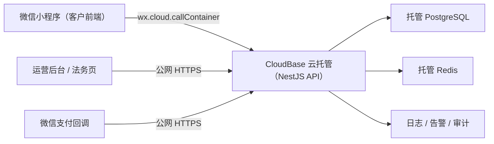

# Talk & Talk 市场化调整计划（微信小程序 / 技术审查版）

> 研究与审查日期：2026-07-25  
> 代码基线：`main` / `f75efbd`  
> 本轮范围：产品、市场、交易、技术、运营、合规、融资证据  
> 当前动作：先完成技术闭环；本文件保留市场研究依据，并以 0.1 节作为已确认的执行边界  
> 融资目标假设：首批 300–500 名真实激活用户后，尝试人民币 100万–300万元天使轮

## 0. 怎么看这份计划

全文只使用五种状态：

| 状态 | 含义 |
|---|---|
| **保留** | 已有基础正确，继续使用 |
| **调整** | 保留能力，但重做产品表达或业务规则 |
| **暂停** | 暂不新增或扩大推广；现有代码、数据和恢复能力保留，不等于删除功能 |
| **待验证** | 不能靠猜，必须通过用户、支付或平台资质验证 |
| **上线门禁** | 不通过就不能真实收费上线 |

建议先审第 1、2、12、16 节；其余章节是判断依据与执行细化。

### 0.1 已确认的技术决策（覆盖全文中冲突的旧建议）

| 决策 | 当前状态 | 已确认的执行边界 |
|---|---|---|
| D2 实时语音 | **调整** | 为已人工接单、已支付且由陪伴者手动开始服务的语音订单接入订单级 TRTC 房间；不把语音留言冒充实时通话。 |
| D3 手动接单 | **调整** | 流程固定为“客户发起预约 → 陪伴者手动接受/拒绝 → 客户在保留期内支付 → 陪伴者手动开始服务 → 实时语音 → 完成/售后”。 |
| D4 功能范围 | **保留** | 除社区和 iOS 可在未来单独评审是否退出发布范围外，其他既有功能均不移除；本阶段不删除任何代码。 |
| D7 价格 | **暂停** | 不写死首发价格、不做价格实验结论；价格继续沿用现有商品快照能力，待业务另行决定。 |
| D8 融资 | **暂停** | 先补齐交易、权限、实时语音、安全和发布门禁；融资叙事不属于本轮技术实施范围。 |

这张表优先于下文此前“即时付款”“文字优先”“隐藏更多能力”或“固定价格/融资”的建议；下文已同步为当前口径，保留的研究说明不构成开发指令。

### 0.2 当前可审查状态

| 事情 | 状态 | 现在能确认什么 |
|---|---|---|
| 订单级实时语音、手动接单和聊天权益 | **调整** | 代码、自动化测试和本地小程序构建已完成；不等于已对真实用户开放。 |
| CloudBase、真实微信支付与 TRTC 真机链路 | **上线门禁** | 需要真实环境、密钥、平台权限和两台真机留证。 |
| 可售商品读模型、经营漏斗、真实信任指标 | **待验证** | 仍是首发商业闭环的缺口，不能用现有页面或种子数据替代。 |
| 价格与融资 | **暂停** | 按 D7/D8 后置；本轮不做价格结论或融资叙事。 |

---

## 1. 一页结论

### 1.1 总判断

| 问题 | 结论 |
|---|---|
| 现在能否全面商用 | **不能。当前适合做 P0 改造，不适合直接放量。** |
| 后端是否要推倒重写 | **不需要。保留 NestJS 模块化单体、PostgreSQL、Redis。** |
| 哪里需要大改 | **订单级实时语音、人工接单体验、服务权益、支付后履约权限、审核与发布门禁。** |
| 首发渠道 | **微信小程序。** |
| 后端部署 | **微信云托管 CloudBase Cloud Run；后端不是运行在小程序包里。** |
| 首发方式 | **300–500 人封闭付费首发，不做公开大投放。** |
| 融资逻辑 | **暂停；本轮只交付可审查的技术和运营风险控制能力。** |
| 推荐周期 | **T+6 至 T+10 周达到首轮 Go / Fix / Stop 决策点。质量优先，不以工作量删减必要项。** |

### 1.2 推荐定位

> **给暂时不需要诊疗、但想被认真听见的人，一段按时开始、有边界、可追责的真人线上陪伴。**

对用户只承诺四件事：

1. 价格和时长在付款前说清楚。
2. 预约时间准时开始。
3. 沟通只在平台内进行，有明确服务边界。
4. 出现爽约、越界或服务问题时，可以举报、退款和追责。

明确不做：

- 不宣传心理治疗、诊断、治愈焦虑或抑郁。
- 不做危机热线。
- 不做交友、相亲或陌生人社交广场。
- 不允许导流到微信私聊、电话或其他平台。

### 1.3 质量优先的核心方向

**从“很多陪伴者资料供用户慢慢逛”，改成“少量标准服务在明确时间内可以立即购买”。**

这不是一次界面美化，而是商业模型重排：

`人设市场` → `标准商品` → `真实可售时段` → `陪伴者人工接单` → `支付保留` → `陪伴者手动开场的限时服务` → `核验评价` → `一键复购`

---

## 2. 调整方向总表

| 领域 | 当前状态 | 调整方向 | 首发决定 |
|---|---|---|---|
| 微信登录、同意与账户 | 基础完整 | 精简首次同意流程，保留撤回与注销 | **保留** |
| 陪伴者认证与商业资料 | 后端基础较强 | 公开说明“认证了什么”，禁止手工伪造交易指标 | **调整** |
| 服务商品与可预约时段 | 已有结构化模型 | 成为唯一商品和价格来源 | **保留** |
| 发现页 | 筛选、排序、旧价格过多 | 改为“场景 + 真实商品 + 最近可约时间” | **调整** |
| 陪伴者详情 | 信息过重 | 只保留信任证据、商品、时段、真实评价 | **调整** |
| 预约 | 创建后仍需陪伴者手工确认 | 保留人工接单，强化响应时限、拒单、支付保留和服务开始说明 | **调整** |
| 支付 | 财务幂等和订单快照较完整 | 仅在陪伴者接受后开放支付；真实回调与退款验收 | **调整** |
| 聊天 | 已完成订单仍可能长期可发消息 | 改成订单级、时间级服务权益 | **调整** |
| 实时语音 | 当前没有可商用 RTC 闭环 | 实现仅限订单参与者、服务窗口内可进入的 TRTC 语音房间 | **上线门禁** |
| 语音留言/媒体 | 生产存储和内容分析适配器未完成 | 保留现有能力；如扩大生产媒体交付，先补齐加密存储、审核和删除闭环 | **暂停** |
| 公共评价 | 后端存在，用户端闭环缺失 | 完成订单后添加“已购评价” | **待验证** |
| 社区广场 | 增加冷启动与审核负担 | 代码和现有入口不动；如需调整发布范围，未来单独评审 | **保留** |
| 个性化推荐 | 有服务端基础，但商品可售性不足 | 保留现有功能，后续独立评审排序和可售性 | **保留** |
| 收藏 | 对复购有轻价值 | 保留现有能力 | **保留** |
| 最近浏览、复杂提醒 | 系统复杂度高，商业价值未证实 | 保留现有能力，暂不扩建 | **保留** |
| iOS、Apple 登录、短信、App 支付 | 当前后端部署目标为微信小程序 | 现有代码和接口保留；iOS 仅可在未来单独评审发布范围 | **保留** |
| 运营后台、审核、退款、审计 | 后端能力较完整 | 补齐真实运营 SOP 与权限验收 | **调整** |
| 产品数据 | 只有局部推荐归因和运维指标 | 建立完整付费漏斗与队列指标 | **待验证** |

---

## 3. 深度 Product Review：发现的十个核心问题

### 3.1 人工接单是当前确认的服务模型，关键是把它做成可预期的履约闭环

**代码事实**

- 创建订单后，陪伴者默认有约 10 分钟确认窗口。
- 只有陪伴者确认后，用户才可以进入预支付。
- 即使用户选择了已经发布、已有容量控制的结构化时段，也要再次等待人工确认。
- 订单创建和支付状态的关键实现位于 [`orders.service.ts`](../backend/api/src/orders/orders.service.ts) 与 [`payments.service.ts`](../backend/api/src/payments/payments.service.ts)。

**当前判断**

人工接单不是缺陷，而是本轮已确认的服务承诺：陪伴者有权决定是否接这笔服务，客户在接受前不被扣款。需要修复的是“等待时不知道发生了什么”和“接单后履约边界不清”，不是删除人工确认。

**技术计划**

- 订单仍是 `pending`，直到陪伴者明确接受或拒绝；只能由该陪伴者的已认证账号处理。
- 接受后只在支付保留期内开放支付；拒绝或超时不扣款并释放时段。
- 支付完成后，只有陪伴者能在服务窗口手动开始服务；这一步才开启实时语音权限。
- 在订单页明确展示响应截止、支付截止、服务开始与完成条件，并保留拒单、退款、客服和审计记录。

状态：**调整**

### 3.2 实时语音代码已补齐，但尚不能在验收前宣称已上线

**代码事实**

- 商品可以声明 `deliveryMode: voice`，前端也出现“语音陪伴”文案。
- 已实现订单级 TRTC 实时语音：服务端短效签发、订单/售后权限校验、小程序 `live-pusher` / `live-player` 音频房间、手动静音和离页退出；紧急下线时先拒绝新凭证并由服务端清空已登记房间，再关闭语音能力。
- 已实现服务端房间终止：退款申请、服务完成或服务窗口结束后会关闭同一订单的字符串房间；关闭失败有数据库租约、退避重试和审计，不会回滚已经提交的支付或订单状态。
- 已安装并锁定 `tls-sig-api-v2@1.0.2` 与 `trtc-wx-sdk@1.1.15`；微信开发者工具已生成小程序 RTC 构建产物，`npm run verify:voice-release-artifacts` 已通过。
- 当前仍不能把它标为“已上线”：真实数据库迁移、腾讯云密钥/CAM、主体类目权限、域名白名单与两台真机验收尚未完成。依赖门禁通过不代替这些外部验收。
- `TRTC_ENABLED=false` 或紧急清场时，公开语音商品和语音筛选会安全关闭；订单创建、确认、支付、开始服务和入房接口仍在服务端逐层拒绝，避免只隐藏按钮而留下可付费入口。
- 现有语音能力是聊天内短语音附件；生产媒体存储、转写与内容分析适配器尚未完成，仓库说明要求生产保持媒体能力关闭。

**平台事实**

微信小程序实时音视频依赖 `live-pusher` / `live-player` 或 TRTC 方案，并受主体、类目、接口权限和真机验证限制；个人主体和测试号存在明显限制。腾讯官方文档要求在开工前先核对资质与类目，而不是只完成代码即可上线。[TRTC 小程序接入条件](https://cloud.tencent.com/document/product/647/32399)、[TUICallKit 小程序方案](https://cloud.tencent.com/document/product/647/49327)

**技术计划**

- 后端只在订单已人工接单、已支付、`inService` 且未过服务结束时间时，向两名订单参与者签发短效房间凭证；退款、完成和超时不能再签发，并触发服务端关闭既有房间。
- `TRTC_SDK_SECRET_KEY`、腾讯云 API 密钥和签名逻辑只在服务器。`UserSig` / `PrivateMapKey` 是当前订单参与者的短效运行时入房材料：不可写入小程序存储、日志或分析系统，调用者也不能指定他人、订单或房间。
- 语音房间标识与订单一一对应；进入、签发、关闭和重试均写入不含密钥与音频内容的审计记录。
- 仍保留现有聊天内语音留言能力，绝不把它包装成实时通话；录音、转写、内容审核和存储另走既有媒体上线门禁。
- 上线前必须完成企业主体、类目、`live-pusher`/`live-player` 权限、TRTC 套餐、域名白名单和真机双端验收；缺任一项则保持开关关闭，不假装已上线。
- 可执行的上线/回滚步骤见 [实时语音上线核对表](./realtime-voice-release-checklist.md)。

状态：**上线门禁**

### 3.3 付费时长和聊天权限没有形成闭环

**代码事实**

- 服务端已按订单和时间计算聊天权益：仅 `paid` / `inService` 的服务前、服务中和短暂收尾窗口允许普通文字或媒体消息。
- 已完成订单的历史仍可查看，但不再允许新建普通文字或媒体消息；举报、售后和客服入口不受影响。
- 发送时会在会话事务内再次校验窗口，避免页面状态过期或并发请求绕过限制；实现位于 [`conversations.service.ts`](../backend/api/src/conversations/conversations.service.ts)。

**商业影响**

购买 30 分钟服务后可能形成长期免费聊天，导致：

- 服务时长无法兑现为收费边界；
- 陪伴者被迫继续劳动；
- 用户没有复购理由；
- 越界和安全风险持续扩大。

**计划**

- 会话历史永久可读，但普通消息只在以下窗口可发：
  - 服务前物流窗口；
  - 订单服务窗口；
  - 短暂收尾窗口。
- 举报、售后和客服入口不受聊天窗口关闭影响。
- 权益按订单记录，不再用“历史上存在完成订单”作为永久通行证。

状态：**调整**（代码和自动化测试已完成；真实环境仍需验收）

### 3.4 推荐和发现可能展示根本买不到的陪伴者

**代码事实**

- 公开列表主要检查发布、用户认证与商业认证。
- 默认列表和推荐资格并不始终要求“存在有效商品 + 未来真实可约时段”。
- 推荐中的可用性仍混用旧的在线状态和旧 availability 字段。

**商业影响**

用户点击一个看起来很合适的人，进入详情却没有可买商品或可约时间；这会让推荐越精准，失望越强。

**计划**

首发“可售陪伴者”的唯一判断：

`公开且认证` + `存在有效 SKU` + `存在未来可售时段` + `未暂停接单`

没有时段时，只能明确显示“暂不可约/加入候补”，不能混入立即可约结果。

状态：**待验证**

### 3.5 页面价格和真实成交价格可能不是同一个来源

**代码事实**

- 发现卡片和部分排序仍使用旧 `pricePerHalfHour`。
- 真正可购买的商品有独立 `priceCents`、时长和交付方式。
- 订单在有商品时使用商品价，没有商品时退回旧价格逻辑。

**商业影响**

筛选价、卡片价、详情价和结算价可能表达不一致，用户会认为价格不透明。

**计划**

- 客户端继续以商品快照为价格事实来源，避免展示价和成交价不一致。
- 本轮不设定公开固定价格、不增加价格实验规则；最终价格和活动策略待业务另行决定。
- 旧 profile 价格只保留迁移兼容，不作为新的价格结论。

状态：**暂停**

### 3.6 部分“信任数字”可以被后台手工写入

**代码事实**

- 真实评价会检查完成订单并重新计算评分，这是正确的。
- 但陪伴者创建/更新 DTO 仍允许写入评分、评价数、完成单数、响应时间、距离、在线状态等公开数字。
- `completedOrders` 等字段没有完整的真实订单派生链路。
- 种子数据中存在看似成熟业务的评分与交易数字；虽然生产默认不应加载种子，但模型设计仍允许人工制造信任。

**计划**

- 评分、评价数、已完成订单、准时率、复购率全部改成只读派生指标。
- 样本不足时显示“新陪伴者”，不显示虚假精确数字。
- “已认证”必须让用户知道认证了身份、协议还是服务能力。
- 城市、距离、在线状态若不影响线上交付，则从首发界面移除。

状态：**待验证**

### 3.7 后端有已购评价，用户端没有完成公开评价闭环

**代码事实**

- 服务端评价创建会校验已完成订单，并可以形成真实聚合评分。
- 小程序 API 客户端具备创建评价能力，但订单完成页没有完整使用它。
- 当前“体验反馈”更接近私有运营反馈，不等同于公共已购评价。

**计划**

完成服务后只出现一个简单页面：

1. 私密问题反馈/申请售后；
2. 可选公开“已购评价”；
3. 一键复购。

两类数据必须明确分开，不能把私密安全反馈公开。

状态：**调整**

### 3.8 现有数据不能回答“为什么没成交”

**代码事实**

- 推荐模块能记录曝光、查看、点击、创建订单和支付。
- 但没有覆盖同意 → 首页 → 商品 → 时段 → 订单 → 支付 → 准时开始 → 完成 → 评价 → 复购的统一客户端漏斗。
- 现有监控更偏服务器健康，不等同于产品经营数据。

**计划**

- 建立隐私最小化的一方事件模型。
- 每周自动生成漏斗、用户 cohort、商品、陪伴者、渠道与退款看板。
- 首发期间所有产品决策都必须能对应一个事件和一个退出指标。
- 用户关闭个性化后，不再继续为推荐目的收集同类标签。

状态：**待验证**

### 3.9 首发产品面远大于现阶段市场证据

当前小程序有 5 个 Tab、14 个页面，并同时承载社区、推荐、收藏、提醒、最近浏览、订单、聊天、陪伴者工作台和复杂安全说明。后端还有历史 iOS、多登录渠道、多支付路径等能力。

**判断**

这不是“功能不够”，而是“用户第一次进来不知道应该买什么”。社区还会额外引入内容审核、未成年人保护和冷启动负担。网络内容平台需要承担账号、内容、评论、巡查和应急等治理责任。[国家网信办《网络信息内容生态治理规定》](https://www.cac.gov.cn/2019-12/20/c_1578375159509309.htm?dt_dapp=1&source=timeline)

**计划**

- 本阶段只把社区和 iOS 作为未来可能退出发布范围的候选项；是否隐藏另行评审。
- 个性化推荐、收藏、最近浏览、复杂提醒、短信、支付等既有能力均保留，暂不删除代码或接口。
- 所有改造采用“扩展 → 验证 → 决策”的方式，不以删功能换取开发速度。

状态：**保留**

### 3.10 核心文件过大，未来每次商业调整都容易互相伤害

当前存在多份接近或超过 2,000 行的核心服务/页面，例如订单、支付、陪伴者服务和小程序订单页。它们不是立刻重写后端的理由，但已构成高风险修改热点。

**计划**

- 按用例拆分订单、支付、商品列表、会话权益与售后逻辑。
- 小程序订单列表与订单详情分离。
- 采用“扩展 → 迁移 → 收缩”，不做一次性破坏性数据库迁移。
- 不删除历史 Prisma migration。
- 每一个小提交都可独立测试、部署和回滚。

状态：**调整**

---

## 4. 市场研究结论

### 4.1 为什么微信小程序方向成立

- 腾讯披露微信及 WeChat 月活已超过 14 亿，微信小程序已经形成大规模交易基础；这说明微信是合适的触达和支付容器，不代表上线后会自动获得流量。[腾讯微信产品页](https://www.tencent.com/zh-cn/products/weixin-wechat/)
- 微信小程序的典型入口包括二维码和微信搜索，因此首发必须同时设计私域二维码、内容渠道和邀请链路。[腾讯小程序产品页](https://www.tencent.com/products/weixin-mini-programs/)
- 微信支付小程序场景需要商户开通 JSAPI/小程序支付权限并完成商户号与 AppID 绑定。[微信支付官方接入说明](https://pay.wechatpay.cn/doc/v3/merchant/4015459512)

结论：**微信适合承接交易，不应被当作免费获客渠道。**

### 4.2 竞品给出的有效启发

竞品文案仅代表其公开产品定位，不代表其效果数据已经被第三方验证。

| 参照 | 可学习 | 不照搬 |
|---|---|---|
| [比心](https://apps.apple.com/cn/app/%E6%AF%94%E5%BF%83-%E6%89%BE%E6%B8%B8%E6%88%8F%E9%99%AA%E7%BB%83%E4%B8%8A%E6%AF%94%E5%BF%83app%E5%B0%B1%E5%A4%9F%E4%BA%86/id1286964732?l=en-GB) | 用具体服务、价格和可用供给促成交易 | 游戏陪练、泛娱乐和强社交定位 |
| [松果倾诉](https://apps.apple.com/cn/app/%E6%9D%BE%E6%9E%9C%E5%80%BE%E8%AF%89-%E5%BF%83%E7%90%86%E4%B8%8E%E6%83%85%E6%84%9F%E5%92%A8%E8%AF%A2/id1223389923) | 私密倾诉、场景分类、供需两端分工 | 医疗化或资质边界不清的表达 |
| [7 Cups](https://www.7cups.com/about/faq.php) | 清楚区分普通倾听者与专业治疗；强调培训和持续教育 | 免费社区规模和海外业务规则 |
| [Soul](https://www.soulapp.cn/) | 证明陌生人社交需要独立的内容与关系生态 | 首发复制广场、群聊和 UGC 冷启动 |

结论：**成交依赖“具体服务 + 真实可约 + 即时开始/明确预约”，不是依赖更多个人简介和更多筛选器。**

### 4.3 融资环境对本项目的含义

清科研究显示，2026 年第一季度中国股权投资市场整体回暖，但机构关注仍明显集中在 IT、半导体、医疗健康、机械制造、AI 等硬科技方向。[清科研究 2026 首季 VC/PE 简报](https://news.pedaily.cn/202605/563435.shtml)

因此，一个非医疗的消费服务小程序不能只讲“市场很大”。百万元级天使融资更需要：

- 一个很窄但高频/高痛的用户问题；
- 几百名用户中的真实付费与 cohort 复购；
- 可复制的供给训练和排班系统；
- 安全、支付、税务和内容风险可控；
- 一轮融资能买到的下一个可融资里程碑。

YC 的种子融资指南同样强调：多数早期公司需要产品、客户采用和增长证据，融资金额应对应未来 12–18 个月的下一个可融资里程碑；这是通用融资原则，不是中国交易结构或估值建议。[YC Seed Fundraising Guide](https://www.ycombinator.com/blog/this-brief-guide-is-a-summary-of-what-startup-founders-need-to-know-about-raising-the-seed-funds-critical-to-getting-their-company-off-the-ground)

投资人更关心 cohort 留存而非累计下载/注册量；累计用户数本身是虚荣指标。[a16z Startup Metrics](https://a16z.com/16-startup-metrics/)

---

## 5. 首发产品定义

### 5.1 目标用户假设

**首轮不是所有人。**

- 22–35 岁成年人；
- 有“此刻想被听见、但不想向熟人解释”的具体时刻；
- 接受在线、付费、定时、非医疗的真人文字陪伴；
- 首轮建议集中在工作日晚间 19:00–23:00。

“女性友好”可以成为招募、视觉、安全和运营原则，但不能在没有供给、认证与安全证据时写成排他或绝对承诺。

状态：**待验证**

### 5.2 当前商品与交付技术边界

| 商品/能力 | 交付 | 价格 | 当前技术决定 |
|---|---|---|---|
| 现有文字陪伴服务 | 按已确认的订单、支付和服务窗口交付 | **暂停** | **保留** |
| 实时语音服务 | TRTC；仅“人工接单 → 支付 → 陪伴者手动开始”后的订单双方可进入 | **暂停** | **上线门禁** |
| 语音留言互动 | 现有短语音附件能力保留 | **暂停** | **保留** |
| 自定义时长/自定义服务 | 保留既有兼容能力 | **暂停** | **保留** |

价格不是本轮技术计划的决策项。系统只保证商品快照、订单金额、支付金额与退款金额可追溯且一致；公开价格、优惠和实验策略由业务另行审议后配置。

### 5.3 首页只回答三个问题

1. 我现在为什么需要它？
2. 谁在什么时候可以提供哪项服务？
3. 我付多少钱、能得到多长时间？

本轮不以隐藏社区或改动导航来达成上述表达；首页、社区和其他既有入口是否调整，留待后续单独产品评审。

---

## 6. 市场化后的用户旅程

| 步骤 | 用户看到什么 | 系统必须保证 |
|---|---|---|
| 1. 进入 | 一句话价值、成年人说明、必要隐私告知 | 不在同意前采集非必要画像 |
| 2. 选场景 | “下班后想说说”“需要有人专心听”等 3–5 个场景 | 场景只用于当前选择；个性化另行开关 |
| 3. 看商品 | 3–6 张可买卡片：陪伴者、商品、价格、最近时段 | 每张卡都真实可售 |
| 4. 看详情 | 认证范围、边界、真实评价、商品和时段 | 不出现可手工伪造的数字 |
| 5. 发起预约 | 一次确认服务、时长、退款规则和等待时间 | 幂等订单、陪伴者人工接受/拒绝、响应时限 |
| 6. 接单后支付 | 陪伴者接受后才展示支付；支付保留期明确 | 原子支付、超时释放、不可绕过人工接单 |
| 7. 服务中 | 陪伴者手动开始后展示倒计时、边界、举报和客服；语音订单可进入实时语音 | 仅订单双方、仅服务窗口、仅无售后暂停时获得短效房间凭证 |
| 8. 服务后 | 私密反馈、已购评价、一键复购 | 历史可读；普通聊天关闭 |

---

## 7. 当前技术范围：保留、调整、暂不扩展

### 7.1 保留

- 微信登录与成年人/隐私同意；
- 陪伴者身份、协议、结算资料和商业审核；
- 结构化商品、结构化可用时段；
- 订单金额快照、幂等、支付、退款、结算与审计基础；
- 举报、拉黑、客服、内容审核和安全事件；
- 陪伴者工作台的排班、订单和收入核心部分；
- 运营管理后台；
- NestJS + PostgreSQL + Redis。

### 7.2 大幅调整

- 陪伴者人工接单、拒单、支付保留与手动开始服务的状态表达；
- 订单级实时语音的鉴权、服务窗口、售后暂停、审计与真机验收；
- 订单状态表达；
- 聊天权益；
- 发布前配置、迁移、部署预检和安全审计。

### 7.3 暂不作为本轮代码改动的事项

- 社区、iOS 是否调整发布范围：未来单独评审，本轮不删除代码或入口；
- 首页、发现、搜索、推荐、收藏、最近浏览、提醒等既有功能：保留，不因本轮语音改造移除；
- 语音留言、AI 能力、未成年人策略、全国投放和价格策略：不在本轮技术验收中扩展或作商业结论。

---

## 8. 技术与微信部署方向

### 8.1 推荐架构

CloudBase 云托管支持任意容器化框架、VPC 资源连接、版本与灰度流量，适合保留现有 NestJS 后端，而不是重写成大量云函数。[CloudBase 云托管介绍](https://docs.cloudbase.net/run/introduction)、[小程序调用云托管](https://docs.cloudbase.net/run/develop/access/mini)、[连接腾讯云资源](https://docs.cloudbase.net/run/develop/resource-integration/tencentcloud)、[服务与版本设置](https://docs.cloudbase.net/run/deploy/service-setting)

### 8.2 部署门禁

- 测试和生产使用不同 CloudBase 环境；
- PostgreSQL、Redis 与 API 在同一 VPC；
- 生产最小实例数至少为 1，避免支付/登录链路冷启动不可控；
- `/health`、就绪探针、灰度版本、快速回滚可用；
- 微信 AppSecret、商户密钥、数据库凭据只放密钥系统；
- 数据库自动备份和恢复演练通过；
- 支付回调、运营后台和法务页保留公网 HTTPS；
- 出站网络可访问微信支付与审核服务；
- 日志不记录 token、完整聊天正文、证件和支付敏感信息；
- 核心业务告警能在值班渠道到达真实负责人。

状态：**上线门禁**

### 8.3 数据与代码改造原则

- 允许大范围调整最终结构，但不做 big-bang 重写。
- 新表/新字段先添加并双写，历史数据完成迁移后再停止旧读。
- 旧接口至少保留一个发布周期。
- 所有可售判断集中为一个 marketplace read model，避免列表、推荐、详情各自算一遍。
- 订单交易规则从巨型 service 拆成明确用例与策略。
- 聊天权限由独立 entitlement 领域负责。
- 财务事件使用幂等处理和可追溯 outbox。
- 历史数据库 migration 不删除、不重排。

---

## 9. 可审查的代码调整顺序

这是 `main` 工作区的当前状态，不是生产上线宣告。“调整”代表代码与自动化门禁已补齐；仍标为“上线门禁”或“待验证”的事项不能跳过真实环境验收。

| 编号 | 调整 | 当前状态 | 可审查完成标准 |
|---|---|---|---|
| C01 | 增加实时语音发布功能开关 | **调整** | 代码已完成：关闭或紧急清场时隐藏公开语音入口，并在创建、确认、支付、开始服务和入房接口二次拒绝。 |
| C02 | 建立“可售商品列表”读模型 | **待验证** | 公开卡片 100% 对应有效商品和未来可约时段。 |
| C03 | 统一公开价格来源 | **暂停** | 列表、详情、订单和支付显示同一商品快照价；按 D7 后续决定价格策略。 |
| C04 | 固化人工接单订单状态机 | **调整** | 代码已覆盖：仅陪伴者可接受/拒绝；接受后客户才可支付；陪伴者再手动开始服务。 |
| C05 | 验证既有时段与支付保留 | **待验证** | 真实 PostgreSQL 并发下同一容量不超卖，支付超时安全释放。 |
| C06 | 增加订单级实时语音权限 | **调整** | 代码已完成：仅已接受、已支付、已手动开始、未售后的语音订单参与者获得短效房间凭证。 |
| C07 | 增加订单级聊天权益 | **调整** | 代码已完成：物流、服务、收尾窗口可测；完成订单历史只读，普通文字和媒体不可新建。 |
| C08 | 重做首页和详情 API | **待验证** | 一次返回商品、价格、下一可约时段和可信指标。 |
| C09 | 增加已购评价闭环 | **待验证** | 仅完成订单可评价；私密问题与公开评价分离。 |
| C10 | 建立全漏斗事件与 outbox | **待验证** | 所有核心事件可重放、去重、生成 cohort 看板。 |
| C11 | 保持现有导航与功能范围 | **保留** | 不因本轮改造移除社区以外的现有能力；社区/iOS 也不删除代码。 |
| C12 | 为订单页增加实时语音入口 | **调整** | 代码已完成：仅在合规状态下显示，不能绕过接单、支付或手动开始。 |
| C13 | 增加实时语音页 | **调整** | 代码已完成：短效凭证不落盘、不写日志；离开页面释放麦克风。 |
| C14 | 增加语音售后与到期退出 | **调整** | 代码已完成：售后中不得新入房；服务窗口结束由服务端关房并由客户端退出。 |
| C15 | 补齐陪伴者工作台的手动开始提示 | **调整** | 代码已完成：接单、支付、开始服务、进入语音的职责清晰。 |
| C16 | 派生真实信任指标 | **待验证** | 评分、完成单、准时率不可人工编辑。 |
| C17 | CloudBase 测试环境与真实微信验收 | **上线门禁** | 登录、支付、回调、退款、聊天、评价和双端语音全链路通过。 |
| C18 | 保留旧模型和非首发模块 | **保留** | 本轮不删除代码；任何未来收缩另立评审、迁移和回滚方案。 |

### 关键测试

- 同一时段多人并发锁位；
- 重复点击下单、重复支付回调、乱序回调；
- 支付超时和锁位释放；
- 取消、改期、退款和退款回调；
- 未接单、未支付、未开始、非订单参与者、售后中、服务到期时均不能进入实时语音；
- 两台真机的实时语音、静音、重连、服务到期退出和凭证不落盘；
- 服务开始前、进行中、结束后的聊天时间旅行测试；
- 完成订单后的评价唯一性和审核；
- 用户关闭个性化、删除标签、注销账户；
- 真机微信登录、支付、订阅通知和弱网恢复；
- CloudBase 扩缩容、灰度、回滚和数据库恢复；
- 关键日志脱敏；
- 运营角色越权测试。

---

## 10. 分阶段计划

### 阶段 A：决策与真实需求验证（T+0 至 T+5 天）

状态：**待验证**

交付：

- 审批本计划第 16 节的 8 个决策；
- 访谈 15 名目标用户；
- 访谈 5–8 名候选陪伴者；
- 用人工预约或可退款意向金验证付费意愿；
- 核对小程序主体、服务类目、支付权限、备案和实时语音资格；
- 定稿用户协议、服务边界、退款、未成年人和危机升级口径。

退出条件：

- 至少 8/15 名目标用户能描述相似的真实触发场景；
- 至少 5 人愿意为明确的 30 分钟服务支付或付意向金；
- 至少 5 名合格陪伴者愿意按统一标准排班；
- 小程序类目与支付方案得到平台/专业顾问确认。

这些是内部验证阈值，不是行业基准。

### 阶段 B：P0 商业闭环重构（T+1 至 T+4 周）

状态：**调整**

本轮已完成 C01、C04、C06、C07、C11–C15 的代码与自动化覆盖；C05 仍需真实数据库并发验证，C02、C08–C10、C16 仍待开发/验证，C03 按 D7 暂停。

范围：

- 完成剩余 C02、C05、C08–C10、C16；
- 建立测试环境和经营看板；
- 准备陪伴者训练、排班、安全和售后 SOP；
- 所有公开文案通过医疗化/夸大承诺审查。

退出条件：

- 全链路自动化测试通过；
- 所有首页商品都可直接购买；
- 价格、时长和聊天权益一致；
- 严重级别的已知安全/财务缺陷为 0。

### 阶段 C：微信真实环境验收（T+4 至 T+6 周）

状态：**上线门禁**

范围：

- CloudBase 测试与生产环境；
- 真实 AppID、商户号、支付与退款；
- 1 分钱/小额真实订单；
- 真实支付回调、订阅通知、弱网、灰度和回滚；
- 运营值班演练和数据库恢复演练；
- 小程序提审、备案和隐私保护指引。

退出条件：

- 完整真实链路连续通过；
- 关键告警可到达值班人；
- 支付账目、订单账目和退款账目可核对；
- 所有上线门禁签字。

### 阶段 D：300–500 人封闭付费首发（至少 4 周）

状态：**待验证**

建议规模：

- 300–500 名真实激活成年用户；
- 120–200 名付费用户；
- 250–400 笔付费服务；
- 8–12 名经过培训和审核的陪伴者；
- 工作日晚间 19:00–23:00 集中供给；
- 不做广泛付费投放。

运营方式：

- 创始人/核心团队每天查看真实会话异常、退款、爽约和用户访谈；
- 每周只做一次产品决策，基于 cohort 而非个别声音；
- 第一批流量来自可追踪二维码、微信私域、内容合作和真实邀请；
- 每名付费用户在 24–72 小时内获得回访机会；
- 严重安全事件立即暂停新单，不等待周会。

### 阶段 E：融资或继续修正（达到 100 名付费用户且观察满 30 天后）

状态：**待验证**

- **Go 融资：**安全门禁全部通过，付费、复购、供给和单位经济达到第 12 节阈值。
- **Fix：**用户喜欢但某一个漏斗或供给环节明显失效，继续修正 2–4 周。
- **Stop/Pivot：**愿意表达兴趣但不愿付费、服务难标准化或风险无法控制。

---

## 11. 获客与运营方向

### 11.1 首发获客

| 渠道 | 用法 | 是否首发 |
|---|---|---|
| 微信群/私域二维码 | 每个来源使用独立 scene 参数 | **是** |
| 公众号/视频号内容 | 用具体触发场景，不宣传治疗效果 | **是** |
| 首单后邀请 | 只在高满意完成单后展示 | **是** |
| KOC 小规模合作 | 固定页面、固定优惠、可归因 | **待验证** |
| 广泛信息流广告 | PMF 前容易买到低质量流量 | **暂停** |
| 社区自然增长 | 当前没有供需密度和审核团队 | **暂停** |

推荐首发文案：

> **预约一段被认真听见的时间。真人在线，准时开始，站内沟通，出现问题可以售后。**

禁止文案：

- “治愈焦虑/抑郁”
- “专业心理治疗”（除非未来具备相应资质与独立业务）
- “绝对隐私”“100% 安全”
- “最懂你”“保证有效”

### 11.2 供给侧

陪伴者不是简单上传头像就能接单。首发必须完成：

- 身份、成年人、服务协议与结算信息；
- 统一边界与禁用表达培训；
- 模拟服务和考核；
- 每周固定排班；
- 准时率、完成率、退款、举报和复购的质量评分；
- 禁止私下联系方式和站外收款；
- 危机关键词与异常事件升级；
- 退出、暂停接单和申诉流程。

状态：**上线门禁**

---

## 12. “几百用户可融资”的证据目标

### 12.1 先说清楚

**300–500 个注册用户不能保证融资。**

要争取人民币 100万–300万元天使轮，这几百名用户必须形成一张密度很高的证据表。以下是本项目的内部融资门槛建议，不是行业统一标准，也不是融资承诺。

### 12.2 核心指标

| 指标 | 建议门槛 | 为什么重要 |
|---|---:|---|
| 真实激活成年用户 | 300–500 | 有明确来源、完成核心行为，不买量灌水 |
| 付费用户 | 120–200 | 证明不是只有兴趣 |
| 付费服务单 | 250–400 | 足够观察服务稳定性和初步 cohort |
| 商品详情 → 选时段 | ≥ 25% | 商品和信任表达有效 |
| 锁位 → 支付成功 | ≥ 70% | 即时交易链路有效 |
| 准时开始率 | ≥ 90% | 供给可运营 |
| 无人工救火完成率 | ≥ 85% | 产品不是纯人工项目 |
| 退款 + 有责争议率 | ≤ 8% | 服务承诺可信 |
| 30 日付费复购率 | ≥ 25% | 最重要的可融资证据之一 |
| 首单后推荐/邀请占新增 | ≥ 20% | 初步口碑 |
| 严重安全事故 | 0 | 硬门禁 |
| 变量贡献毛利 | 第 250 单前转正，或有明确补贴上限 | 证明放量不会越做越亏 |

变量贡献毛利统一按下式计算：

`实收价 - 陪伴者结算 - 支付费 - 单均审核/客服成本 - 退款损失 - 单均补贴`

不把创始人暂未领工资或未计入的人工成本隐藏起来；融资模型中另列完整人力、云资源、法务合规和获客费用。

### 12.3 融资叙事

建议只讲一条主线：

1. **问题：**很多成年人有短时、具体、非医疗的被倾听需求，但向熟人表达成本高，传统咨询又过重。
2. **产品：**在微信里按时购买一段有边界、可追责的真人陪伴。
3. **证据：**几百名用户中出现真实付费、复购、推荐和稳定供给。
4. **壁垒：**服务标准、供给训练、交易与安全数据、质量分配系统，而不是聊天页面本身。
5. **规模化：**先从一个时段和一个商品做密度，再扩时段、商品和实时语音。
6. **本轮资金用途：**买到下一个可融资里程碑，不是补一个模糊预算缺口。

### 12.4 融资数据室

达到融资门槛前，应准备：

- 12 页以内融资 BP；
- 2 分钟真实产品演示；
- 周度注册、激活、付费、订单、GMV、净收入、复购 cohort；
- 渠道来源和自然邀请占比；
- 供给数量、排班覆盖、准时率、利用率和流失；
- 退款、举报、安全事件和处理时长；
- 单位经济与 18 个月三档预算；
- 公司主体、股权结构、知识产权归属；
- 用户协议、隐私政策、服务协议、结算与税务方案；
- 小程序备案、平台类目、支付资质；
- 安全与内容治理 SOP；
- 技术架构、测试结果、备份与灾备说明；
- 本轮资金达到的下一里程碑和失败止损点。

中国融资交易结构、估值、股权比例、税务和劳动/合作关系必须由中国执业律师、会计师与实际投资方确认，本计划不替代专业意见。

---

## 13. 上线与继续投入的决策规则

### 硬门禁：任何一项不通过就不能放量

- 小程序主体、类目、备案、支付权限明确；
- 服务不构成未获许可的医疗/心理诊疗宣传；
- 关键隐私、个性化关闭、删除和注销可用；
- 严重安全事故为 0；
- 支付、退款、结算账目可核对；
- 生产媒体能力未完成时保持关闭；
- 数据备份、恢复、告警和值班通过演练。

### Go

- 所有硬门禁通过；
- 30 日复购、准时、完成、退款达到门槛；
- 单位经济转正或有明确可接受的补贴上限；
- 至少两个非付费渠道持续带来高质量用户。

### Fix

- 用户愿意付费且评价高，但某一个漏斗环节低于目标；
- 供给密度不足但优质陪伴者的复购明显；
- 价格尚未由业务作出最终决策；
- 允许再用 2–4 周只修一个主问题。

### Stop / Pivot

- 访谈表达强烈，但用户持续不愿支付；
- 付费主要来自熟人支持而非真实需求；
- 完成服务后没有复购或推荐；
- 供给无法标准化，人工救火长期超过可承受范围；
- 合规或安全风险无法在商业模型内解决。

---

## 14. 风险清单

| 风险 | 当前判断 | 处理 |
|---|---|---|
| 用户愿意倾诉但不愿为文字服务付费 | **待验证** | 先收真实意向金/付费，不用问卷点赞代替 |
| 实时语音资质、类目或真机权限不通过 | **高** | 保持 `TRTC_ENABLED=false`，不把语音留言伪装成实时语音；现有文字能力保留 |
| 社区和私聊产生内容安全风险 | **高** | 维持站内审核、举报与聊天权益；是否调整社区发布范围另行评审，不删代码 |
| 陪伴者爽约或越界 | **高** | 训练、排班、准时率、赔付、暂停接单 |
| 被误解为心理治疗 | **高** | 非医疗定位、文案审查、危机转介 |
| 冷启动没有足够可售时段 | **高** | 集中晚间窗口和少量供给，不铺全国 |
| 价格无法覆盖运营 | **中高** | 价格、优惠与实验留待业务决策；技术侧保留金额快照、退款与成本数据能力 |
| 个性化与隐私合规 | **中** | 首发非个性化；保留关闭、删除、非个性化选项 |
| 巨型服务修改引发回归 | **中高** | 小提交、契约测试、扩展迁移收缩 |
| 微信平台审核或支付配置延误 | **中高** | 阶段 A 先核资质，阶段 C 独立门禁 |
| 融资只看用户数、忽略复购 | **高** | 融资讨论后置；先由技术与运营验收产生可核验的交易、履约和安全数据 |

算法推荐规则要求透明、公平，并提供非个性化选项或关闭能力；个人信息保护要求自动化决策不得进行不合理差别待遇。[算法推荐管理规定](https://www.cac.gov.cn/2022-01/04/c_1642894606364259.htm)、[个人信息保护法](https://www.miit.gov.cn/jgsj/zfs/fl/art/2022/art_515a4b20c12f430eab54bb4f56d89f56.html)

2026 年个人信息保护专项行动还明确关注过度收集、画像不透明、无法更正/删除/拒绝，以及关闭推荐后仍继续收集等问题。[工信部门 2026 专项行动公告](https://gsca.miit.gov.cn/zwgk/wlgl/art/2026/art_9b21a3c6342640bf9dd7f7f2dc44f2fd.html)

小程序属于移动互联网应用程序备案范围；平台隐私接口还要求完善隐私保护指引与用户同意流程。[工信部 App 备案通知](https://www.gov.cn/zhengce/zhengceku/202308/content_6897341.htm?type=mobile-internet)、[微信小程序隐私适配说明](https://cloud.tencent.com/document/product/1301/97930)

---

## 15. 本次代码质量核验状态

| 检查 | 结果 |
|---|---|
| 后端单元测试 | **通过：73/73 suites、559/559 tests**（含语音签发、关房关联 RequestId 校验、重试、跨实例限流、紧急清场、订单超时审计、语音关房 readiness 与聊天只读权益） |
| 后端生产构建与产物检查 | **通过** |
| Prisma schema / 语音迁移结构 | **通过：`npx prisma validate`** |
| OpenAPI YAML | **通过：可解析且保留语音房间契约** |
| 小程序结构校验 | **通过：14 pages，5 tabs** |
| 小程序运行时 smoke | **通过：覆盖 383 个 API 调用分支，含服务端关房后的本地退出、完成订单只读和后台凭证竞态退出** |
| 小程序 RTC NPM 构建 | **通过：`trtc-wx-sdk@1.1.15` 已由微信开发者工具构建** |
| 语音依赖/构建物门禁 | **通过：`npm run verify:voice-release-artifacts`** |
| CloudBase 模板门禁 | **通过：`npm run verify:cloudbase-template`** |
| 发布 preflight | **通过：15/15** |
| 真实 PostgreSQL/Redis E2E | **待验证：当前机器没有 Docker/测试数据库** |
| npm 生产依赖在线漏洞审计 | **待验证：需要明确允许将依赖元数据发送至 npm 官方审计服务；本次重验未获该权限** |
| 真实微信登录/支付/退款 | **待验证：需要实际 AppID、商户号与测试环境** |
| TRTC 实时语音 | **待验证：需要主体、类目、接口权限与真机** |

这些通过项证明现有工程有可保留的基础，不证明产品已经达到市场化或生产放量条件。

---

## 16. 需要你审查的 8 个决定

以下为已确认的执行决定；D1、D5、D6 仍保留为背景性审查项。

- [ ] **D1 定位：**首发定位为非医疗、按时、付费、有边界的真人陪伴。
- [x] **D2 商品：**现在补齐实时语音；只能作为订单内、服务窗口内的真实语音服务。
- [x] **D3 交易：**陪伴者必须手动接单或拒单；接受后客户支付，陪伴者再手动开始服务。
- [x] **D4 范围：**除社区和 iOS 外，不移除任何既有功能；本阶段不删除任何代码。
- [ ] **D5 微信架构：**小程序做前端，NestJS 部署 CloudBase 云托管，PostgreSQL/Redis 同 VPC。
- [ ] **D6 首发规模：**300–500 激活用户、120–200 付费用户、250–400 笔付费服务。
- [x] **D7 价格实验：**价格以后再定；本轮不写死价格或价格实验策略。
- [x] **D8 融资门槛：**先补齐对商务重要的技术闭环，再单独讨论融资。

---

## 17. 本轮技术实施完成项与剩余上线门禁

已完成的技术闭环：

1. [x] 订单级 TRTC 凭证签发、PrivateMapKey、短效权限和审计；
2. [x] 语音关闭/紧急清场时的公开入口安全关闭，以及创建、确认、支付、开始服务和入房接口的服务端二次拦截；
3. [x] 陪伴者人工接单、支付保留、手动开始服务的订单状态机保持不变并接入语音权限；
4. [x] 订单级聊天权益：服务窗口内可沟通，完成订单只读，举报/售后/客服不受影响；
5. [x] 小程序独立实时语音页面和订单入口；不替换现有语音留言；
6. [x] 退款、服务完成和服务超时的服务端强制关房、租约、退避重试与审计；
7. [x] 签名/RTC 依赖锁定、微信开发者工具 NPM 构建、配置校验、迁移、OpenAPI、部署核对表和自动化测试；

剩余的真实上线门禁：在 staging/production 执行并核验数据库迁移、配置 CloudBase 密钥与常驻实例、腾讯云 CAM 最小权限、TRTC/小程序主体类目和域名配置、真实支付回调/退款、两台真机双端验收。以上全部通过前，保持实时语音开关关闭。
